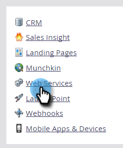
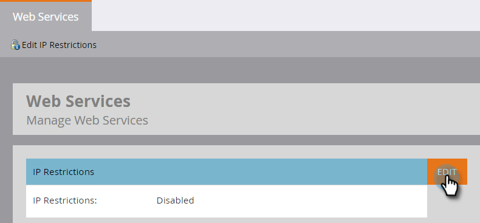
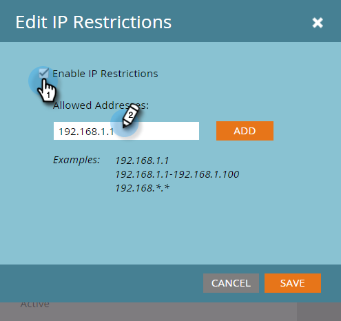

# Create an Allowlist for IP-Based API Access {#create-an-allowlist-for-ip-based-api-access}

Sometimes, you want to give API access only to a specific IP address or a range of addresses. To do this, you first enable restrictions, then specify the IP addresses that are allowed to use the APIs.

>[!NOTE]
>
>**Admin Permissions Required**

>[!NOTE]
>
>This feature operates independently of Marketo Engage [IP-based login restrictions](https://experienceleague.adobe.com/en/docs/marketo/using/product-docs/administration/settings/restrict-marketo-logins-based-on-ip){target="_blank"} that are being replaced by Admin Console's [IP-based access control](https://helpx.adobe.com/enterprise/using/ip-based-access.html){target="_blank"}. It will continue to function as-is after the Adobe IMS migration.

1. Go to the **[!UICONTROL Admin]** area.

   

1. Click **[!UICONTROL Web Services]**.

   

1. In the **[!UICONTROL IP Restrictions]** area, click **[!UICONTROL Edit],** or click **[!UICONTROL Edit IP Restrictions]** in the upper left.

   

1. Check the **[!UICONTROL Enable IP Restrictions]** box and enter the IP addresses you want to Allowlist.

   

   >[!NOTE]
   >
   >You can enter a single IP address or a range of them, or use a wildcard.

1. Click **[!UICONTROL Add]** to open additional fields to enter more IP addresses.

   

1. Click **[!UICONTROL Save]**.

   
