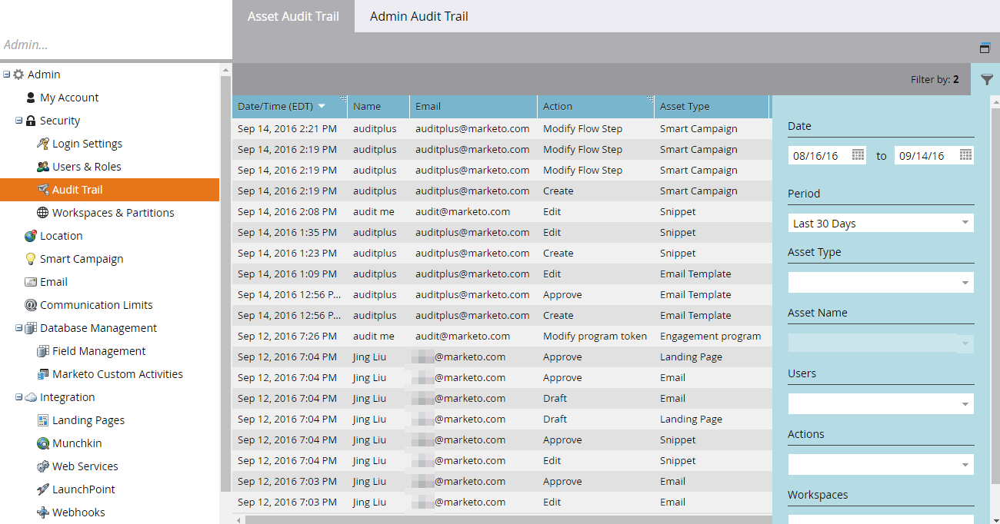

# [!DNL Audit Trail] Overview {#audit-trail-overview}

[!DNL Audit Trail] gives you the ability to obtain a complete history (six months' worth) of changes made within your Marketo instance.

>[!NOTE]
>
>[!DNL Audit trail] data history began back on September 14, 2016.

## What is [!DNL Audit Trail] {#what-is-audit-trail}

[!DNL Audit Trail] captures, in real-time, a comprehensive list of actions and events occurring within a Marketo subscription. It includes a self-serve way to access a six-month history of data to help answer questions such as:

What happened to this asset or setting, and who last updated it?

What has user X been up to?

Who is logging into our account?

## What We [!DNL Audit] {#what-we-audit}

Marketo will audit the [create, edit and delete](/help/marketo/product-docs/administration/audit-trail/change-details-in-audit-trail.md) actions for:

* Design studio assets
* All Marketo programs
* Smart campaigns
* Lists (smart/static)
* Users (admin)
* Roles and permissions (admin)
* Workspace and partitions (admin)
* User login history

>[!NOTE]
>
>Marketo is _not_ auditing changes made within [!DNL Web Personalization], [!DNL Predictive Content], or [!DNL Sales Insight] at this time.

## [!DNL Audit Trail] Components {#audit-trail-components}

[!DNL Audit Trail] consists of three components.

**1) [Asset [!DNL Audit Trail]](/help/marketo/product-docs/administration/audit-trail/change-details-in-audit-trail.md#asset-audit-trail)**

See activity done to specific assets.

**2) [Admin [!DNL Audit Trail]](/help/marketo/product-docs/administration/audit-trail/change-details-in-audit-trail.md#admin-audit-trail)**

Monitor user-based details.

**3) [User Login History](/help/marketo/product-docs/administration/audit-trail/user-login-history.md)**

See who's been logging into your subscription and when. Also includes failed login attempts.

>[!TIP]
>
>There's so much you can audit using [!DNL Audit Trail], be sure to utilize [Filtering](/help/marketo/product-docs/administration/audit-trail/filtering-in-audit-trail.md)!

## Exporting Data {#exporting-data}

You can only view 30 days' worth of data in your instance. To obtain (up to) six months' worth, use the export option.

>[!NOTE]
>
>**Definition**
>
>**Unknown:** In [!DNL audit trail], you may see a user's name and email listed as "Unknown." This happens when you make a change to your picklist values in your CRM. These values appear in Marketo forms and landing pages. Doing this update on the CRM side will auto-draft your landing pages referencing the form. In [!DNL audit trail], we will capture that the landing page was drafted, but the user's name and email will show as "Unknown," as we are not able to capture the user info from the CRM side.

>[!MORELIKETHIS]
>
>[Enable [!DNL Audit Trail]](/help/marketo/product-docs/administration/audit-trail/enable-audit-trail.md)
