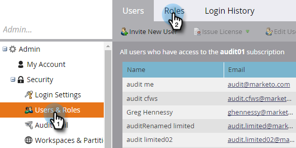
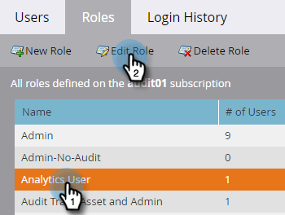
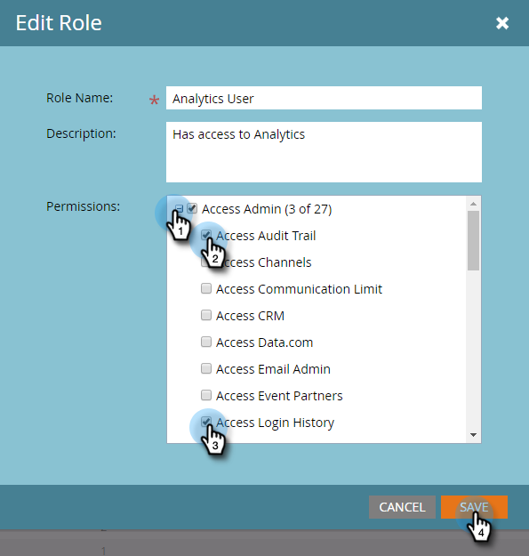
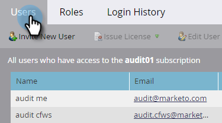
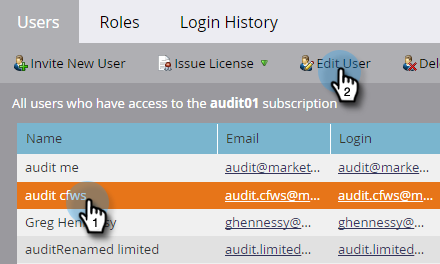

# Enable Audit Trail {#enable-audit-trail}

Audit Trail is available to all customers and controlled by two admin permissions.

>[!NOTE]
>
>By default, all system admin roles have both permissions enabled.

## Enable Audit Trail for a Role {#enable-audit-trail-for-a-role}

1. Click **[!UICONTROL Admin]**.

   

1. Select **[!UICONTROL Users & Roles]** and click **[!UICONTROL Roles]**.

   

1. Select the role you want to enable Audit Trail for and click **[!UICONTROL Edit Role]**.

   

   >[!NOTE]
   >
   >You also have the option here to create a new role and grant it Audit Trail access.

1. Expand the **[!UICONTROL Access Admin]** permission. Select **[!UICONTROL Access Audit Trail]** and/or **[!UICONTROL Access Login History]**, depending on your needs. Click **[!UICONTROL Save]**.

   

   >[!NOTE]
   >
   >**Definition**
   >
   >**[!UICONTROL Access Audit Trail]:** Gives users access to both [!UICONTROL Asset Audit Trail] and [!UICONTROL Admin Audit Trail].
   >
   >**[!UICONTROL Access Login History]:** Gives users access to [User Login History](/help/marketo/product-docs/administration/audit-trail/user-login-history.md).

## Assign Audit Trail Role to a User {#assign-audit-trail-role-to-a-user}

>[!PREREQUISITES]
>
>[Create](/help/marketo/product-docs/administration/users-and-roles/create-delete-edit-and-change-a-user-role.md#create-a-role) or [enable](#enable-audit-trail) an existing role, giving it Audit Trail permissions.

1. In **[!UICONTROL Users & Roles]**, click **[!UICONTROL Users]**.

   

1. Select the user you want to give Audit Trail access to and click **[!UICONTROL Edit User]**.

   

   >[!NOTE]
   >
   >This process also applies when you're creating a new user.

1. Select the Audit Trail roles you created. In this example we created "[!UICONTROL Audit Trail - Asset and Admin]," and "[!UICONTROL Audit Trail - With Login History]."

   

   >[!CAUTION]
   >
   >If you have workspaces enabled, make sure to check the role's checkbox, which selects all workspaces. Deselecting an individual workspace will hide Audit Trail. This means you will see Audit Trail data for every workspace. You do have the option of hiding workspaces when [filtering](/help/marketo/product-docs/administration/audit-trail/filtering-in-audit-trail.md).

1. Click **[!UICONTROL Save]**.

   
