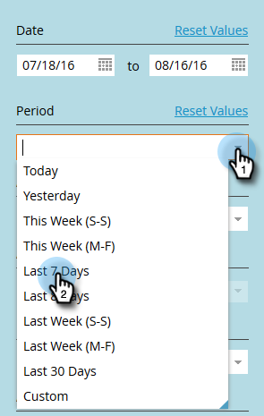
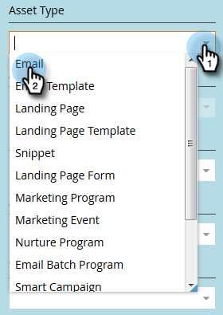

# Filtering in Audit Trail {#filtering-in-audit-trail}

Filter by time frame, asset type, users, action taken, and more.

1. Click **[!UICONTROL Admin]**.

   

1. Under **[!UICONTROL Security]**, select **[!UICONTROL Audit Trail]**.

   

1. Click on the filter icon.

   

   >[!NOTE]
   >
   >There are a multitude of possible search parameter combinations. In this example we locate: _all emails - edited by anyone - in the previous seven days_.

1. Click the **[!UICONTROL Period]** drop-down and select **[!UICONTROL Last 7 Days]**.

   

1. Click the **[!UICONTROL Asset Type]** drop-down and select **[!UICONTROL Email]**.

   

1. Click the **[!UICONTROL Actions]** drop-down and select **[!UICONTROL Edit]**.

   

1. Click **[!UICONTROL Apply]**.

   

1. Filtered results appear on the left.

   

   That's it!

   >[!NOTE]
   >
   >If you have workspaces enabled, you will see audit data for all workspaces. If you apply a workspace filter, Marketo remembers the previous workspace value each time you use audit trail. Workspace permissions at the asset level are enforced.

   >[!MORELIKETHIS]
   >
   >[Change Details in Audit Trail](/help/marketo/product-docs/administration/audit-trail/change-details-in-audit-trail.md)
