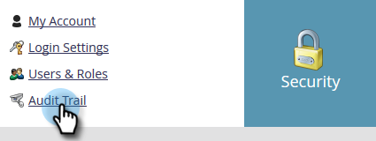
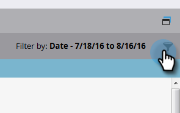
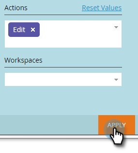
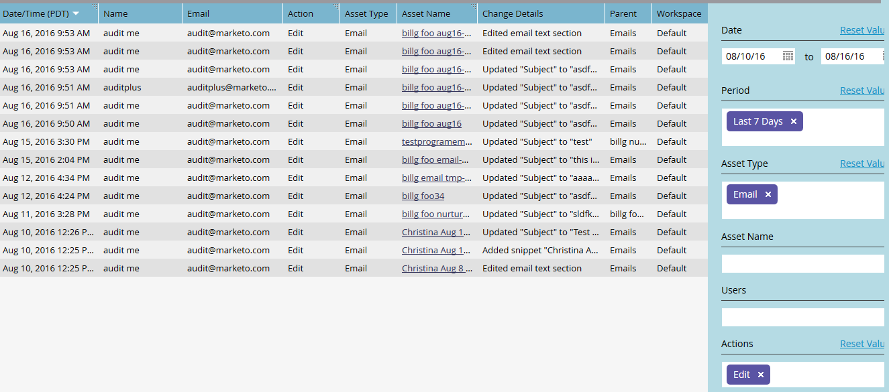

# Filtering in Audit Trail {#filtering-in-audit-trail}

Filter by time frame, asset type, users, action taken, and more.

1. Click **Admin**.

   

1. Under **Security**, select **Audit Trail**.

   

1. Click on the filter icon.

   

   >[!NOTE]
   >
   >There are a multitude of possible search parameter combinations. In this example we locate: _all emails - edited by anyone - in the previous seven days_.

1. Click the **Period** drop-down and select **Last 7 Days**.

   

1. Click the **Asset Type** drop-down and select **Email**.

   

1. Click the **Actions** drop-down and select **Edit**.

   

1. Click **Apply**.

   

1. Filtered results appear on the left.

   

   That's it!

   >[!NOTE]
   >
   >If you have workspaces enabled, you will see audit data for all workspaces. If you apply a workspace filter, Marketo remembers the previous workspace value each time you use audit trail. Workspace permissions at the asset level are enforced.

   >[!MORELIKETHIS]
   >
   >[Change Details in Audit Trail](/help/marketo/product-docs/administration/audit-trail/change-details-in-audit-trail.md)
