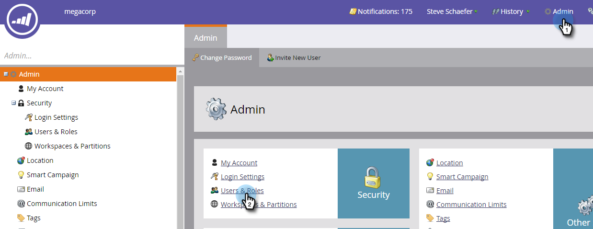
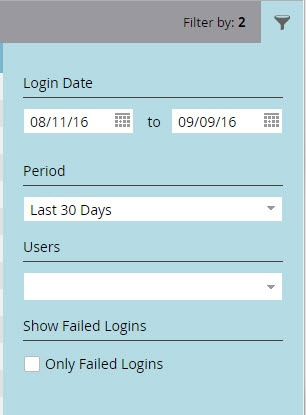
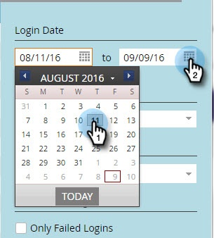
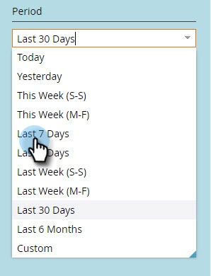
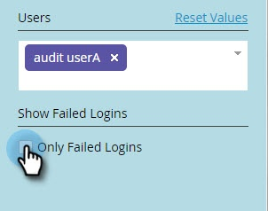

# User Login History {#user-login-history}

The User Login History helps maintain accountability and security by showing you exactly who's been logging into your subscription, including failed login attempts.

>[!PREREQUISITES]
>
>You must have a role with the Access Login History permission enabled to view the User Login History.

The User Login History identifies people who log in by:

* Login Time and Date
* User's name and email address
* Role
* Workspace
* IP Address

To view the User Login History:

1. Click the **Admin** tab and under Security, click **Users & Roles**.

   

1. Click the **Login History** tab. The listing shows the most recent logins.

   

1. Use the Filter to narrow your search.

   

1. Select a date range using the date pickers.

   

1. Or, choose from the drop-down.

   

1. Select the users from the **Users** drop-down.

   

1. Check the **Only Failed Logins** box to display only failed logins in your search.

   

1. Click **Apply**.

   

   >[!NOTE]
   >
   >The user interface displays up to 30 days of data. If you need more, you can download the most recent six months of data to a csv file.

   >[!NOTE]
   >
   >[Audit Trail Overview](/help/marketo/product-docs/administration/audit-trail/audit-trail-overview.md)
