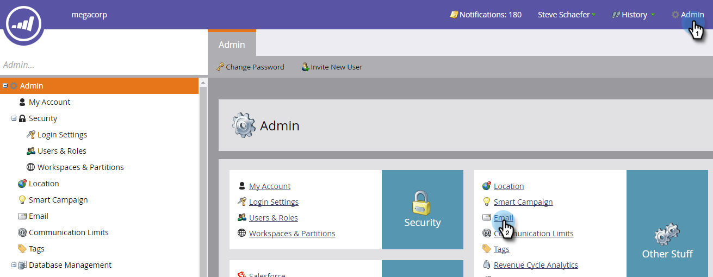
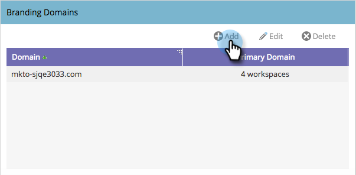
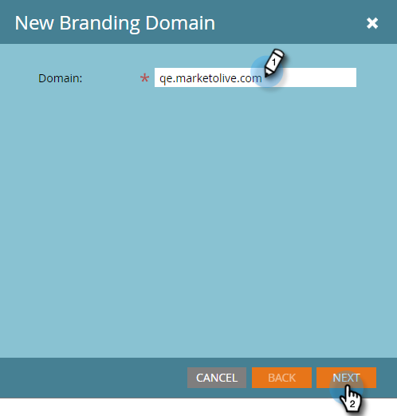
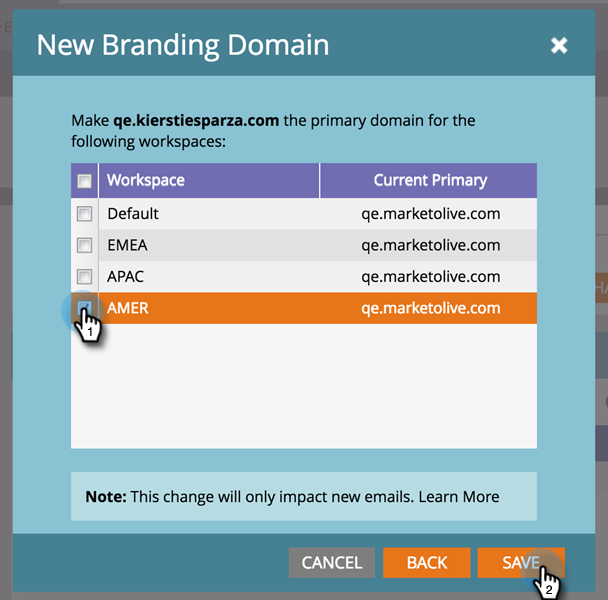

# Add an Additional Branding Domain with Workspaces {#add-an-additional-branding-domain-with-workspaces}

If you have workspaces, you can add additional branding domains.

>[!PREREQUISITES]
>
>You must [edit your default branding domain](/help/marketo/product-docs/administration/email-setup/add-multiple-branding-domains/edit-your-default-branding-domain.md) first.
>
>You must first [replace the generic tracking link](/help/marketo/product-docs/administration/email-setup/add-multiple-branding-domains/edit-your-default-branding-domain-with-workspaces.md) with a branding domain before adding additional branding domains.

1. Go to **Admin** and click **Email**.

   

1. Click **Add** to add an additional branding domain.

   

1. Enter a new branding domain. Click **Next**.

   

   >[!NOTE]
   >
   >You can choose to make this your Primary Domain for one or more workspaces, and all existing unsent emails set to “Default” and all newly created emails will default to the primary domain. You can override this on a per-email basis.

1. Select the new branding domain and click **Save**.

   
