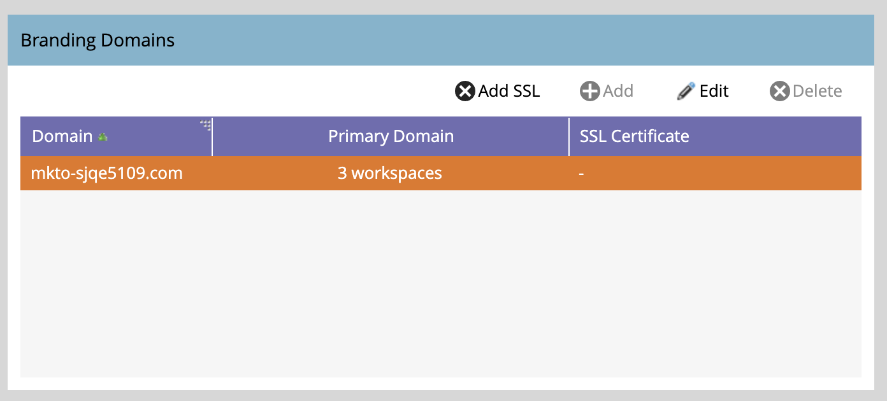
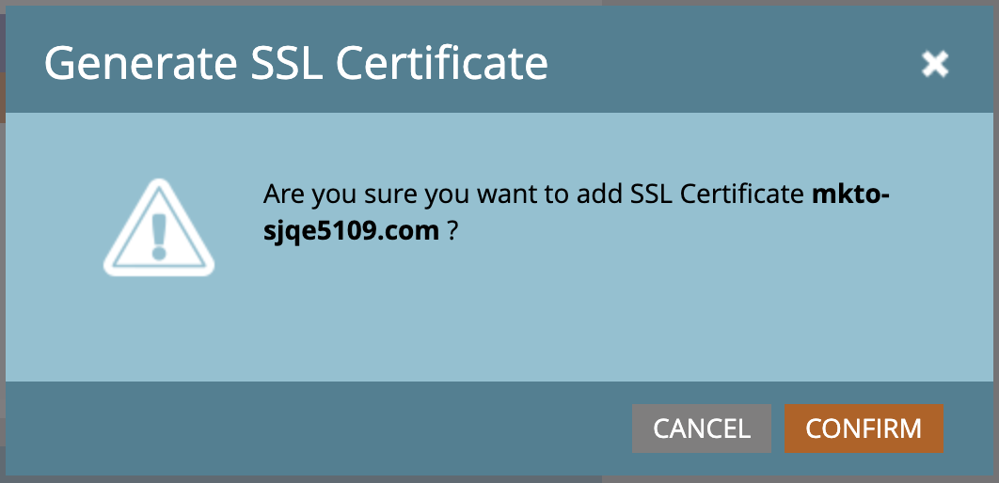

# Add an Additional Branding Domain {#add-an-additional-branding-domain}

Add an additional branding domain when you're running multiple brands out of a single Marketo instance and want them each to have their own branded tracking links.

>[!PREREQUISITES]
>
>You must [replace the generic tracking link](/help/marketo/product-docs/administration/email-setup/add-multiple-branding-domains/edit-your-default-branding-domain.md){target="_blank"} with a branded domain before adding additional branded domains.

1. Go to the **[!UICONTROL Admin]** area.

   

1. Click **[!UICONTROL Email]**.

   

1. Click **[!UICONTROL Add]** to add an additional branding domain.

   {width="600"}

1. Enter the name of your new branding domain, select _Make Primary Domain_ and/or _Generate SSL Certificate_ (both optional), and click **[!UICONTROL Save]**.

   

>[!NOTE]
>
>* _Make Primary Domain_: Make this your primary domain, and all existing unsent emails set to "Default" and all newly created emails will default to the primary domain. You can [overwrite this on a per-email basis](/help/marketo/product-docs/administration/email-setup/add-multiple-branding-domains/overwrite-primary-domain-for-emails.md){target="_blank"}.
>
>* _Generate SSL Certificate_: You can create a Secure Sockets Layer (SSL) with the creation of the domain. The first tracking domain will initiate a one-time set up of infrastructure that may take a few hours. You will be notified upon completion, and you can then set up the first domain. To add SSL to your existing domains, please reach out to [Marketo Support](https://nation.marketo.com/t5/support/ct-p/Support){target="_blank"}.

## Edit SSLs for existing domains

Follow these steps to enable SSL for your existing domains.

1. From the _[!UICONTROL Admin]_ area, select **[!UICONTROL Email]**.

1. On the _[!UICONTROL Domain]_ tab, select the domain row and click **[!UICONTROL Add SSL]**. 

   {width="600"}

1. In the dialog, click **[!UICONTROL Confirm]**.

   {width="400"}

## Error Messages {#error-messages}

<table><thead>
  <tr>
    <th>Error</th>
    <th>Details</th>
  </tr></thead>
<tbody>
<tr>
    <td><i>Domain already exists.</i></td>
    <td>A domain with same name already exists.</td>
  </tr>
  <tr>
    <td><i>Domain is not mapped to the default domain.</i></td>
    <td>The custom domain is not correctly mapped to the default domain. Please verify the domain mapping settings and ensure the DNS configuration points to the correct default domain.</td>
  </tr>
  <tr>
    <td><i>SSL certificates could not be issued due to unsupported CAA records. Request your IT to update your CAA records.</i></td>
    <td>The CAA records are not up to date. For those using Marketo Engage managed SSL certificates, CAA records need to be updated to certificates recommended by our vendor. Please contact your IT department to update the CAA records. See <a href="https://nation.marketo.com/t5/product-blogs/changes-to-marketo-engage-secured-domains-platform/ba-p/329305#M2246">this page</a> for additional details.</td>
  </tr>
  <tr>
    <td><i>SSL certificate has already been issued.</i></td>
    <td>An SSL certificate already exists for this custom domain. No further action is needed unless the certificate has expired or needs to be reissued.</td>
  </tr>
  <tr>
    <td><i>The default domain was not found. Please contact Support for assistance.</i></td>
    <td>There was an issue when trying to locate the default domain. Please reach out to Support so they can investigate.</td>
  </tr>
  <tr>
    <td><i>Unexpected error encountered while creating a domain. Please contact Support for assistance.</i></td>
    <td>An unexpected error has occurred. Please gather logs and error details, and escalate the issue to <a href="https://nation.marketo.com/t5/support/ct-p/Support" target="_blank">Marketo Support</a>.</td>
  </tr>
</tbody></table>

## Things to Note {#things-to-note}

* **DNS mapping for domain to Marketo Engage**: Before adding adding domains in the UI, you must [map CNAMEs to a Marketo-provided domain](https://experienceleague.adobe.com/en/docs/marketo/using/getting-started/initial-setup/setup-steps#customize-your-landing-page-urls-with-a-cname){target="_blank"}.

* **Custom SSLs**: If you need a custom SSL, please submit a [Support ticket](https://nation.marketo.com/t5/support/ct-p/Support){target="_blank"}. Do not use the self-service checkbox for SSL creation.

* **Pre-existing SSLs**: While adding a domain, the system checks for pre-existing SSLs, which may have been manually created prior. If you encounter this validation, create your domain without selecting SSL creation, and we will connect them for you. [Contact Support](https://nation.marketo.com/t5/support/ct-p/Support){target="_blank"} more additional details/options.

* **Deletion of domains**: Automatically deleting a domain **does not** delete the SSL certificate. This guardrail prevents user errors that result in a website being without SSL certificates. If you do want to remove the SSL certificates, [contact Support](https://nation.marketo.com/t5/support/ct-p/Support){target="_blank"}.

>[!MORELIKETHIS]
>
>[Edit Your Default Branding Domain](/help/marketo/product-docs/administration/email-setup/add-multiple-branding-domains/edit-your-default-branding-domain.md){target="_blank"}
