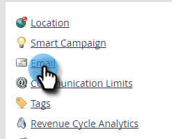

# Delete a Branding Domain {#delete-a-branding-domain}

1. Go to the **[!UICONTROL Admin]** area.

   

1. Click **[!UICONTROL Email]**.

   

1. In the Branding Domains table, select the domain you want to remove and click **[!UICONTROL Delete]**.

   

   >[!NOTE]
   >
   >If you want to delete the primary branding domain, you must first select a different branding domain to be the primary.
