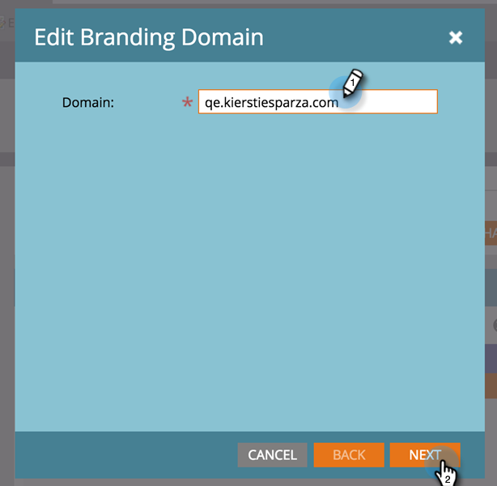

# Edit Your Default Branding Domain with Workspaces {#edit-your-default-branding-domain-with-workspaces}

`1. Go to` **Admin**, then click **Email**. 

2. In the Branding Domains table, select the current generic domain and click Edit to change it to your company's branded domain.

>[!NOTE]
>
>**Add**** **doesn't work until you've edited the generic domain. **Delete**** **doesn't work until you add a second domain.
>
>You can't add an additional domain until you first edit the generic domain.

3. Enter the name of your default domain and click Next.

4. Click Save.

>[!NOTE]
>
>When adding additional branding domains, you can choose to make this your primary domain for one or more workspaces, and all existing unsent emails set to “Default” and all newly created emails will default to the primary domain. You can override this on a per-email basis.

Now, you can [add additional branding domains](add-an-additional-branding-domain-with-workspaces.md) you need for the workspaces. 

>[!NOTE]
>
>**Related Articles**
>
>* [Add an Additional Branding Domain with Workspaces](add-an-additional-branding-domain-with-workspaces.md)
>

