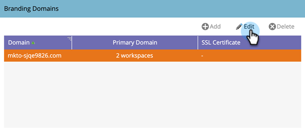
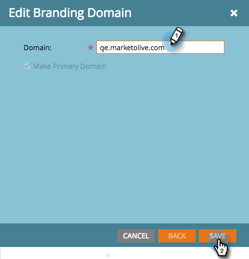

# Edit Your Default Branding Domain {#edit-your-default-branding-domain}

Editing your default branding domain is the first step in working with branding domains.

>[!PREREQUISITES]
>
>Make sure you've [set up a CNAME in your DNS](/help/marketo/getting-started/setup/configure-protocols-for-marketo.md) before you add your branding domains in Marketo.

1. Go to the **[!UICONTROL Admin]** area.

   

1. Click **[!UICONTROL Email]**.

   

1. In the [!UICONTROL Branding Domains] table, select the generic domain and click Edit to change it to your company's branded domain.

   

   >[!NOTE]
   >
   >You can't add an additional domain until you've first edited the generic domain.

1. Enter the name of the your default domain and click **[!UICONTROL Save]**.

   

Now, you can [add any additional branding domains](/help/marketo/product-docs/administration/email-setup/add-multiple-branding-domains/add-an-additional-branding-domain.md) you need.
