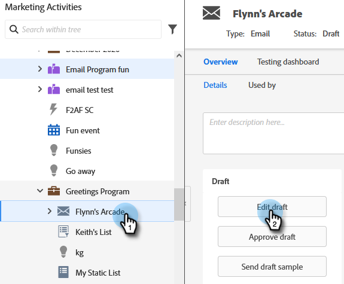
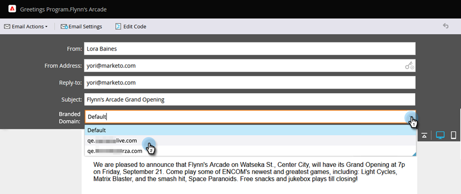

# Overwrite Primary Domain for Emails {#overwrite-primary-domain-for-emails}

You can overwrite the primary branded domain on a per email basis. This will change how the links are branded when the email is sent.

1. Go to **[!UICONTROL Marketing Activities]**.

   

1. Select an email and click **[!UICONTROL Edit Draft]**.  

   

1. Select the branding domain you want to use.

   

   >[!NOTE]
   >
   >Not all users have permissions to set the branded domain on a per-email basis. Contact your admin if you don't see the [!UICONTROL Branded Domains] drop-down.
