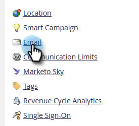
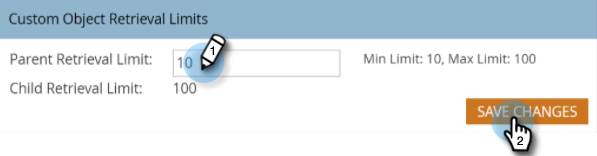

# Change Custom Object Retrieval Limits in [!DNL Velocity Scripting] {#change-custom-object-retrieval-limits-in-velocity-scripting}

If you use [!DNL Velocity Script] to display Custom Object data in emails, this feature might be for you. By default, you're allowed access to 10 parent custom objects from Velocity Script. If you need to access more, read on.

## What is [!DNL Velocity] {#what-is-velocity}

[[!DNL Apache Velocity]](https://velocity.apache.org/) is a language built on [!DNL Java] designed for templating and scripting HTML content. Marketo allows it to be used in the context of Emails through the use of [scripting tokens](/help/marketo/product-docs/email-marketing/general/using-tokens/create-an-email-script-token.md). Among other things, this gives access to data stored in custom objects.

You can reference parent and child custom objects that are directly connected to the Lead, or Contact, but not third-level custom objects. For each custom object, the 10 most recently updated records per person/contact are available at runtime and are ordered from most recently updated (at 0) to oldest updated (at 9).

## How to Change the Limit {#how-to-change-the-limit}

1. Go to the **[!UICONTROL Admin]** section.

   

1. Click **[!UICONTROL Email]**.

   

1. In the [!UICONTROL Custom Object Retrieval Limits] table, enter a new [!UICONTROL Parent Retrieval Limit] and click **[!UICONTROL Save Changes]**.

   

>[!NOTE]
>
>The [!UICONTROL Parent Retrieval Limit] value must be in the range of 10 - 100. The [!UICONTROL Child Retrieval Limit] is set automatically for you. This is done by dividing 1000 by the [!UICONTROL Parent Retrieval Limit]. For example, if you set the Parent limit to 50, the Child limit becomes 20 (1000 ÷ 50 = 20).

Nice! You can now can access more custom objects from [!DNL Velocity script].
