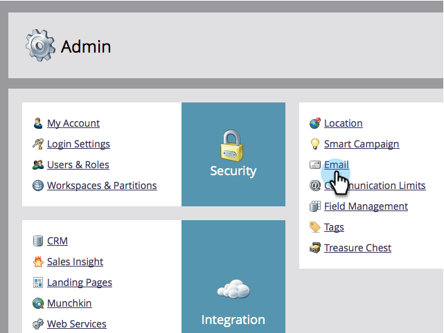

# Change the Default From Email and From Label {#change-the-default-from-email-and-from-label}

Each Admin user has the ability to change the default values for **[!UICONTROL From Email]** and **[!UICONTROL From Label]** so that when they create new emails, those defaults are used.

>[!NOTE]
>
>**Admin Permissions Required**

1. Go to the **[!UICONTROL Admin]** section.

   

1. Click **[!UICONTROL Email]**.

   

1. Enter the default values you want for **[!!UICONTROL From Email]** and **[!UICONTROL From Label]** then click **[!UICONTROL Save Changes]**.

   

>[!NOTE]
>
>The change is only applicable to you and not to other Marketo users.

Good job! Every time you create a new email the default values you set will be used.
