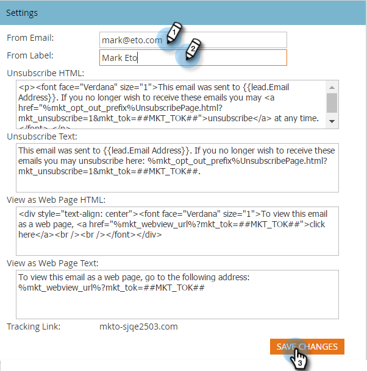

# Change the Default From Email and From Label {#change-the-default-from-email-and-from-label}

Each Admin user has the ability to change the default values for **From Email** and **From Label** so that when they create new emails, those defaults are used.

>[!NOTE]
>
>**Admin Permissions Required**

1. Go to the **Admin** section.

   

1. Click **Email**.

   

1. Enter the default values you want for **From Email** and **From Label** then click **Save Changes**.

   

>[!NOTE]
>
>The change is only applicable to you and not to other Marketo users.

Good job! Every time you create a new email the default values you set will be used. 