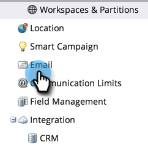
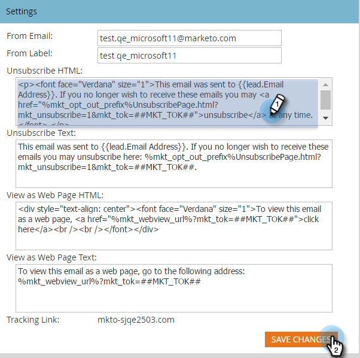

# Edit the Unsubscribe Message {#edit-the-unsubscribe-message}

>[!NOTE]
>
>**Admin Permissions Required**

When you send marketing emails (non-[operational](/help/marketo/product-docs/email-marketing/general/functions-in-the-editor/make-an-email-operational.md)), unsubscribe text and links are appended to the bottom. You can change the defaults. Here's how.

## Where to Make the Edit {#where-to-make-the-edit}

1. Go to the **[!UICONTROL Admin]** section.

   

1. Click **[!UICONTROL Email]**.

   

   >[!CAUTION]
   >
   >The following variables are critical. Don't delete them!
   >
   >* `%mkt_opt_out_prefix%`
   >* `mkt_unsubscribe=1&mkt_tok=##MKT_TOK##`

1. Edit the **[!UICONTROL Unsubscribe HTML]** and **[!UICONTROL Unsubscribe Text]** versions to your liking and click **[!UICONTROL Save Changes]**.

   

   There you have it. _Make sure to test!_ You don't want your marketing emails to have broken unsubscribe links.

>[!TIP]
>
>You can customize the position of the unsubscribe HTML in your email by using [tokens](/help/marketo/product-docs/email-marketing/general/using-tokens/add-a-system-token-as-a-link-in-an-email.md).

## Default Unsubscribe Text {#default-unsubscribe-text}

If you ever need to revert to default system unsubscribe, copy/paste the following:

[!UICONTROL Unsubscribe HTML]:
`<pre data-theme="Confluence">
If you no longer wish to receive these emails, click on the following link: <a href="%mkt_opt_out_prefix%UnsubscribePage.html?mkt_unsubscribe=1&mkt_tok=##MKT_TOK##">Unsubscribe</a> 
</pre>` [!UICONTROL Unsubscribe Text]:
`<pre data-theme="Confluence">%mkt_opt_out_prefix%UnsubscribePage.html?mkt_unsubscribe=1&mkt_tok=##MKT_TOK##</pre>`

>[!MORELIKETHIS]
>
>[Edit the "View as Web Page" Message](/help/marketo/product-docs/administration/email-setup/edit-the-view-as-web-page-message.md)
