# Make Your Unsubscribe Message Dynamic for Languages {#make-your-unsubscribe-message-dynamic-for-languages}

The default unsubscribe message and link are in English. You can use dynamic content to display it in different languages.

>[!NOTE]
>
>This article represents a best practice, but can be accomplished other ways.

## Prepare Your Data {#prepare-your-data}

1. [Create a custom field](/help/marketo/product-docs/administration/field-management/create-a-custom-field-in-marketo.md) named "Preferred Language." (Set it up in your CRM if you want this field to sync).

   >[!TIP]
   >
   >In the future, use this field when you [create a form](/help/marketo/product-docs/demand-generation/forms/creating-a-form/create-a-form.md) to capture language preference.

## Create Segmentation {#create-segmentation}

1. Go to the **[!UICONTROL Database]**.

   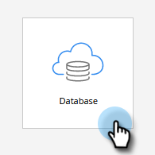

1. In the **[!UICONTROL New]** drop-down, click **[!UICONTROL New Segmentation]**.

   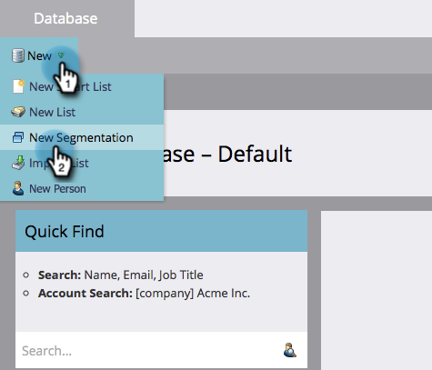

1. Name the segmentation **Preferred Language**. Click **[!UICONTROL Add Segment]**. Type in a language.

   

   >[!NOTE]
   >
   >The default segment will be English.

1. Continue to add segments until all of your languages are represented. Click **[!UICONTROL Create]**.

   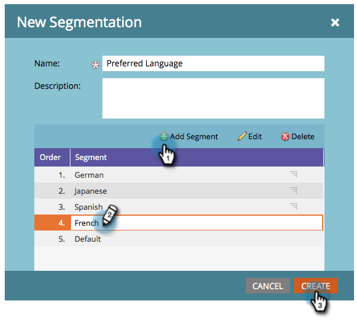

1. Select a segment.

   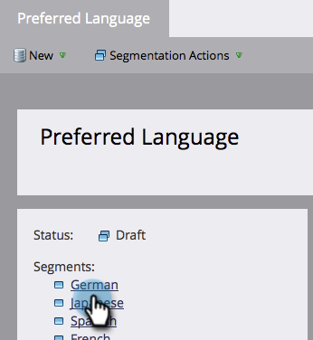

1. Go to the **[!UICONTROL Smart List]** tab. Enter **[!UICONTROL Preferred Language]** into the search field. Drag and drop the filter onto the canvas.

   

1. Set the appropriate corresponding language.

   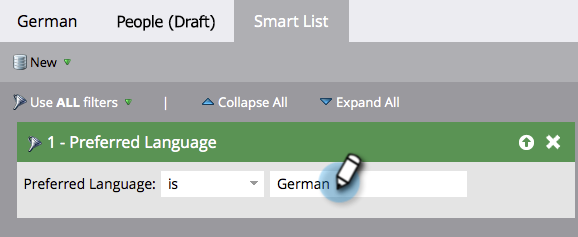

1. Repeat for all your different languages. Then, select the **[!UICONTROL Segmentation Actions]** drop-down and click **[!UICONTROL Approve]**.

   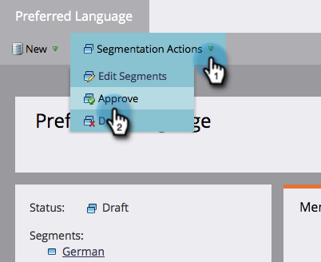

## Create a Snippet {#create-a-snippet}

1. Go to the **[!UICONTROL Design Studio]**.

   

1. In the **[!UICONTROL New]** dropdown, click **[!UICONTROL New Snippet]**.

   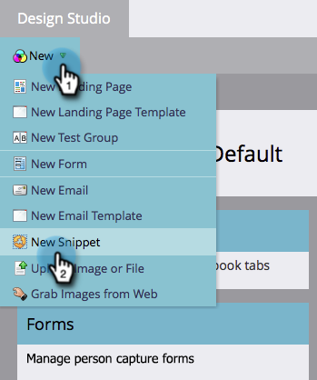

1. Name the snippet **Unsubscribe Message**. Click **[!UICONTROL Create]**.

   

1. Type your default unsubscribe message, highlight it, and click the hyperlink icon.

   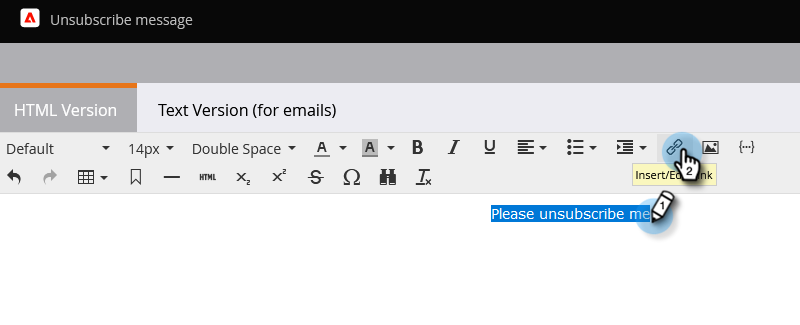

1. Copy and paste this token: `{{system.unsubscribeLink}}` into the **[!UICONTROL URL]** field. Click **[!UICONTROL Insert]**.

   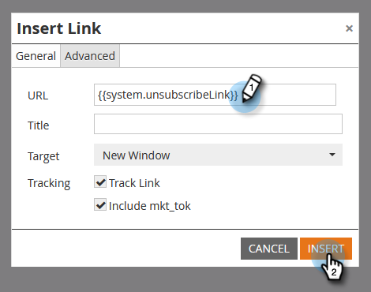

1. Select **[!UICONTROL Segment By]** in the **[!UICONTROL Segmentation]** section.

   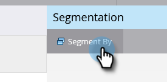

1. From the **[!UICONTROL Segmentation]** drop-down, type in **[!UICONTROL Preferred]** and select **[!UICONTROL Preferred Language]**. Click **[!UICONTROL Save]**.

   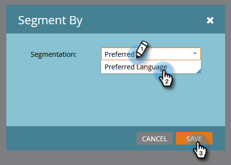

1. Select a segment from the tree. Click on your unsubscribe then the link icon.

   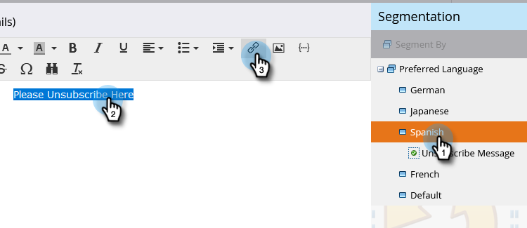

1. Make sure `{{system.unsubscribeLink}}` is still in the **[!UICONTROL URL]** field. Edit the **[!UICONTROL Display Text]** to match the language you selected. Click **[!UICONTROL Apply]**.

   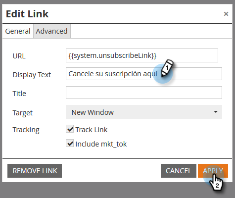

1. Repeat for all your segments. Then, go back to the **[!UICONTROL Design Studio]**, click the **[!UICONTROL Snippet Actions]** drop-down, and click **[!UICONTROL Approve]**.

   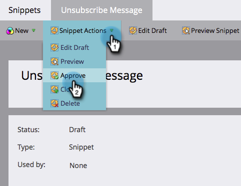

Awesome. Almost there!

## Use Snippet in an Email {#use-snippet-in-an-email}

1. Inside the email editor, click the editable element. Then click the gear icon and select **[!UICONTROL Replace with Snippet]**. If you're selecting an editable snippet element, click the gear icon and select **[!UICONTROL Edit]**.

   

1. Find and select your snippet from the drop-down and click **[!UICONTROL Save]**.

   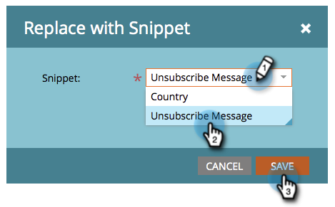

1. To test it out, click **[!UICONTROL Back]**...

   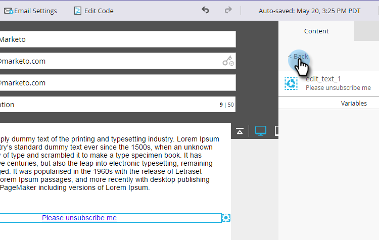

1. ...then the **[!UICONTROL Dynamic]** tab.

   

1. Click the different languages to see the snippet change.

   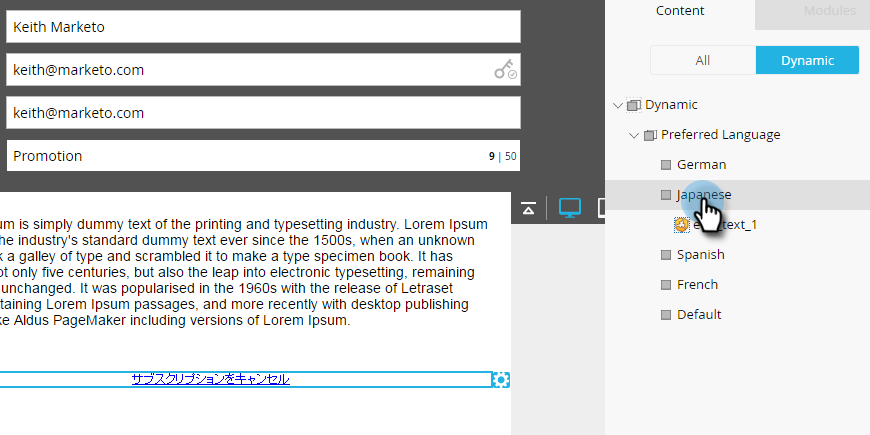

   >[!TIP]
   >
   >Of course, you can edit the rest of your email for dynamic language too. While you are at it, do the same technique on the unsubscribe page.

## Customizing Your Unsubscribe Page with Dynamic Content {#customizing-your-unsubscribe-page-with-dynamic-content}

If you want your people to come to an unsubscribe page in their preferred language, you can use dynamic content on the landing page and the confirmation page.

1. Navigate to the **[!UICONTROL Design Studio]**.

   

1. Type in _Unsubscribe_ in the search field and select your desired Unsubscribe page.

   

1. Click **[!UICONTROL Edit Draft]**.

   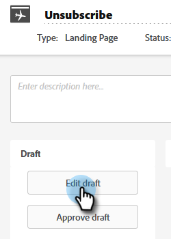

1. Select **[!UICONTROL Segment By]**.

   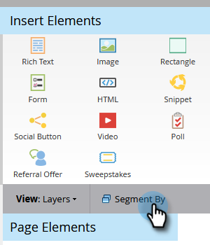

1. Find the **[!UICONTROL Preferred Language]** segment. Click **[!UICONTROL Save]**.

   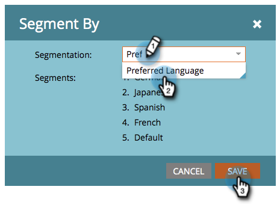

   Edit your content for each landing page, approve, and you're good to go!

   >[!NOTE]
   >
   >Learn more about [dynamic content](/help/marketo/product-docs/personalization/segmentation-and-snippets/segmentation/understanding-dynamic-content.md) and all the cool stuff you can do.
