# Make Your Unsubscribe Message Dynamic for Languages {#make-your-unsubscribe-message-dynamic-for-languages}

The default unsubscribe message and link are in English. You can use dynamic content to display it in different languages.

>[!NOTE]
>
>We set up this nice little tutorial below for you. It represents a best practice, but this can be accomplished other ways.

1. Prepare Your Data 
1. [Create a custom field](../../../../product-docs/administration/field-management/create-a-custom-field-in-marketo.md)named "Preferred Language." (Set it up in your CRM if you want this field to sync).

   >[!TIP]
   >
   >In the future, use this field when you [create a form](../../../../product-docs/demand-generation/forms/creating-a-form/create-a-form.md) to capture language preference.

1. Create Segmentation
1. Go to the **Database**. 
   ** 

   **

1. In the **New** drop-down, click **New Segmentation**.

   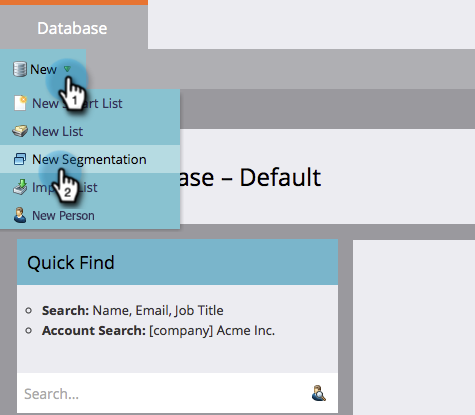 

1. Name the segmentation **Preferred Language**. Click **Add Segment**. Type in a language.

   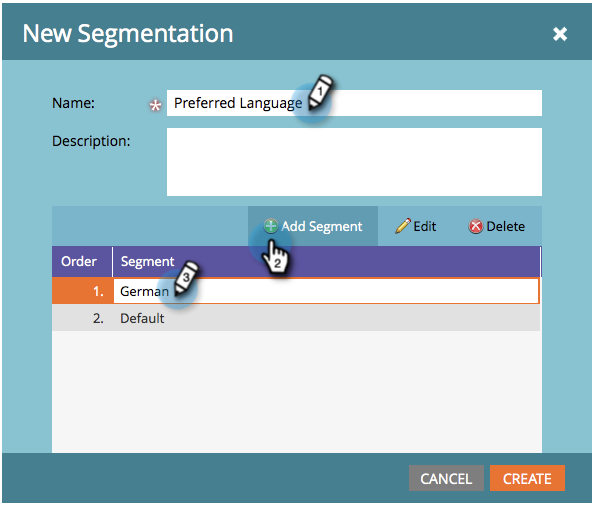

   >[!NOTE]
   >
   >The default segment will be English.

1. Continue to add segments until all of your languages are represented. Click **Create**.

   

1. Select a segment. 

   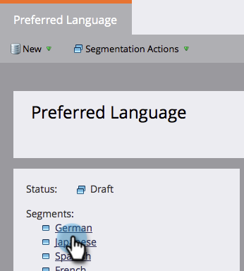

1. Go to the **Smart List** tab. Enter **Preferred Language** into the search field. Drag and drop the filter onto the canvas.

   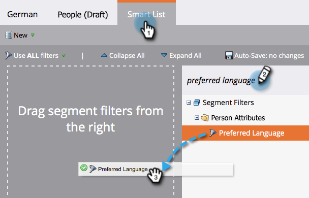

1. Set the appropriate corresponding language.

   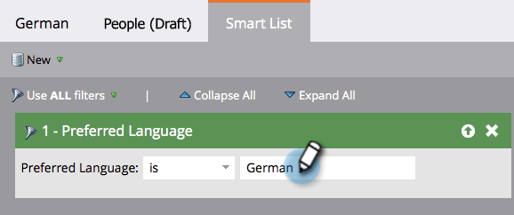

1. Repeat for all your different languages. Then, select the **Segmentation Actions** drop-down and click **Approve**.

   

1. Create a Snippet
1. Go to the **Design Studio**.

   

1. In the **New** dropdown, click **New Snippet**.

   ** 

   **

1. Name the snippet **Unsubscribe Message**. Click **Create**.

   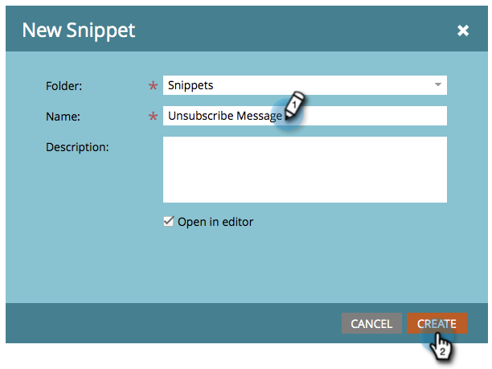

1. Type your default unsubscribe message, highlight it, and click the hyperlink icon.

   

1. Copy and paste this token: **`{{system.unsubscribeLink}}`** into the **Link URL** field. Click **Insert**. 

   

1. Select **Segment By** in the Segmentation section.

   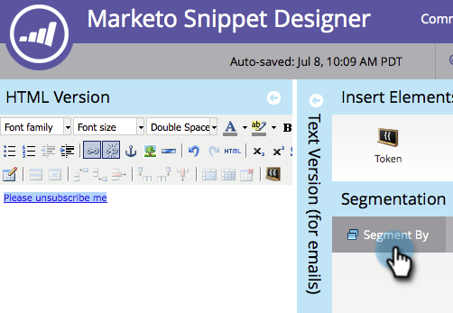

1. From the Segmentation drop-down, type in **Preferred** and select **Preferred Language**. Click **Save**.

   

1. Select a segment from the tree. Type in your unsubscribe message in that language.

   

1. Copy and paste the same token: **`{{system.unsubscribeLink}}`** into the **Link URL** field. Click **Insert**. 

   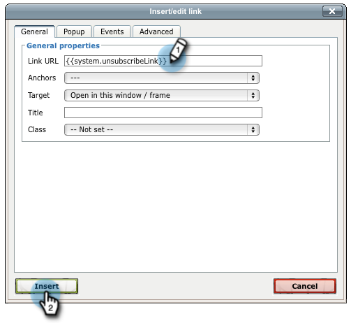

1. Repeat for all your segments. Then, go back to the Design Studio, click the **Snippet Actions** drop-down, and click **Approve**. 

   

   Awesome. Almost there. 

1. Use Snippet in an Email
1. Inside the email editor, click the editable element. Then click the gear icon and select **Replace with Snippet**. If you're selecting an editable snippet element, click the gear icon and select **Edit**.

   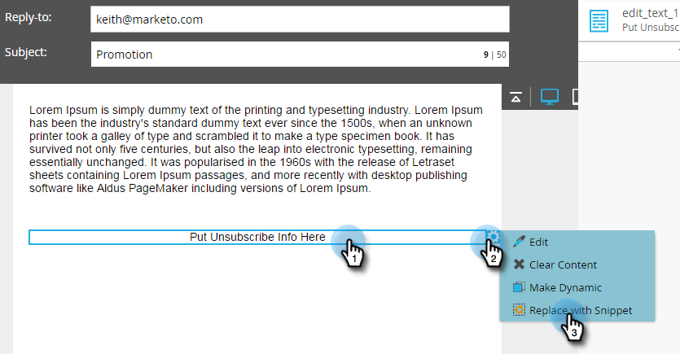

1. Find and select your snippet from the drop-down and click **Save**.

   

1. To test it out, click **Back**...

   

1. ...then the **Dynamic** tab.

   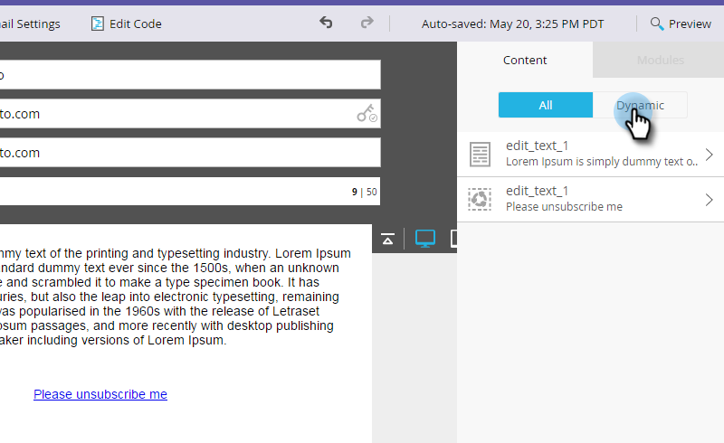

1. Click the different languages to see the snippet change.

   

   >[!TIP]
   >
   >Of course, you can edit the rest of your email for dynamic language too. While you are at it, do the same technique on the unsubscribe page.

1. Customizing Your Unsubscribe Page with Dynamic Content

   If you want your people to come to an unsubscribe page in their preferred language, you can use dynamic content on the landing page and the confirmation page.

   Navigate to the Design Studio.

   

   Type in Unsubscribe in the search field. You should find your Unsubscribe pages.

   

   Click Edit Draft.

   

   Select Segment By.

   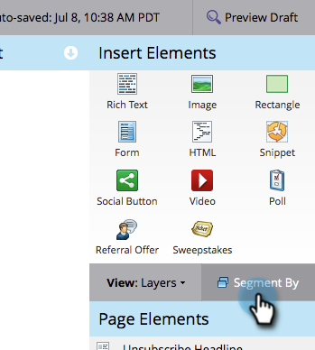

   Find the Preferred Language segment. Click Save.

   

   Edit your content for each landing page, approve, and you're good to go!

   >[!NOTE]
   >
   >**Deep Dive**
   >
   >
   >Learn more about  [dynamic content](../../../../product-docs/personalization/segmentation-and-snippets/segmentation/understanding-dynamic-content.md) and all the cool stuff you can do.

