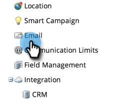

# Edit the "View as Web Page" Message {#edit-the-view-as-web-page-message}

If you need to edit the "[View as a Webpage](/help/marketo/product-docs/email-marketing/general/functions-in-the-editor/add-a-view-as-web-page-link-to-an-email.md)" text, here's how.

>[!NOTE]
>
>**Admin Permissions Required**

## Edit the "View as Web Page" Message {#edit-the-view-as-web-page-message-1}

1. Go to the **[!UICONTROL Admin]** area. 

   

1. Click **[!UICONTROL Email]**.

   

   >[!CAUTION]
   >
   >The following variables are critical. Don't delete them!
   >
   >`%mkt_webview_url%?mkt_tok=##MKT_TOK##`
   >
   >The second part `##MKT_TOK##` is the [!DNL munchkin] cookie of that person. It makes sure they get cookied appropriately when they click the link.

1. Edit the **[!UICONTROL View as Web Page HTML]** and **[!UICONTROL View as Web Page Text]** versions to your liking and click **[!UICONTROL Save Changes]**.

   

>[!CAUTION]
>
>Be sure to avoid:
>
>* Adding additional URLs to either of the HTML boxes
>* Putting HTML in the text version

There you have it. Send out test emails to ensure formatting.

## Default "[!UICONTROL View as Web Page]" Text {#default-view-as-web-page-text}

If you ever need to revert to default system "[!UICONTROL View as Web Page]", copy/paste the following:

**[!UICONTROL View as Web Page HTML]:**

`<pre data-theme="Confluence">
To view this email as a web page, <a href="%mkt_webview_url%?mkt_tok=##MKT_TOK##">click here</a>
</pre>`

**[!UICONTROL View as Web Page Text]:**

To view this email as a web page, go to the following address:
`<pre data-theme="Confluence">%mkt_webview_url%?mkt_tok=##MKT_TOK##</pre>`

That's it!
