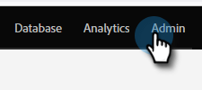
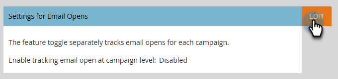
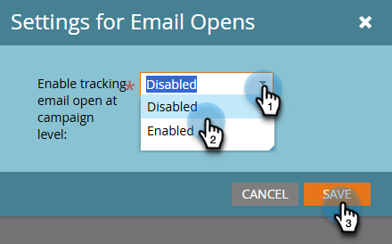

# Email Open Tracking at Campaign Level {#email-open-tracking-at-campaign-level}

This feature allows you to control tracking email opens, either once for each open in a campaign, or just once for each email regardless of how many times it's used in different campaigns.

>[!NOTE]
>
>**Admin Permissions Required**

1. Go to the **Admin** area.

   

1. Click **Smart Campaign**.

   

1. Next to _Settings for Email Opens_, click **Edit**.

   

1. Click the drop-down, choose your desired setting, and click **Save**.

   

<table><tbody>
  <tr>
    <td><b>Enabled</b></td>
    <td>Email opens are tracked separately for each campaign.</td>
  </tr>
  <tr>
    <td><b>Disabled</b></td>
    <td>Email opens are counted based only on unique person opens.</td>
  </tr>
</tbody>
</table>
