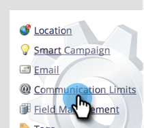
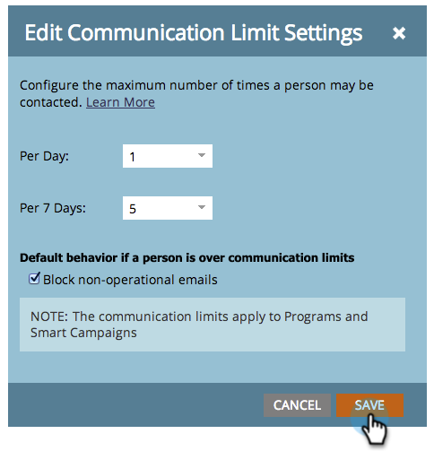

# Enable Communication Limits {#enable-communication-limits}

It's very important to not over-communicate with your people. Setting communication limits will help prevent your organization from sending too many emails.

>[!NOTE]
>
>**Admin Permissions Required**

1. Go to the **Admin** area.

   

1. Click **Communication Limits**.

   

1. Click **Edit**.

   

   >[!NOTE]
   >
   >Per Day is based on the calendar day in the subscription time zone (midnight-midnight).

1. Click the **Per Day** drop-down and select the desired limit. In this example we're choosing 1.

   

   >[!TIP]
   >
   >You can also choose **Custom** if none of the preset options work for you.

1. Click the **Per 7 Days** drop-down and select the desired limit. In this example we're choosing 5.

   

1. Select **Block non-operational emails**.

   

   >[!NOTE]
   >
   >Learn more about what [operational emails](/help/marketo/product-docs/email-marketing/general/functions-in-the-editor/make-an-email-operational.md) are.

1. Click **Save**.

   

   >[!NOTE]
   >
   >**Example**
   >
   >The above settings mean that people won't receive more than **1 email per day** or more than **5 in any seven-day period**.

   >[!NOTE]
   >
   >Communication limits automatically apply to all email and engagement programs.

>[!MORELIKETHIS]
>
>[Apply Communication Limits to Smart Campaign](/help/marketo/product-docs/core-marketo-concepts/smart-campaigns/using-smart-campaigns/apply-communication-limits-to-smart-campaign.md)
