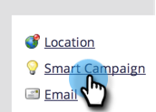
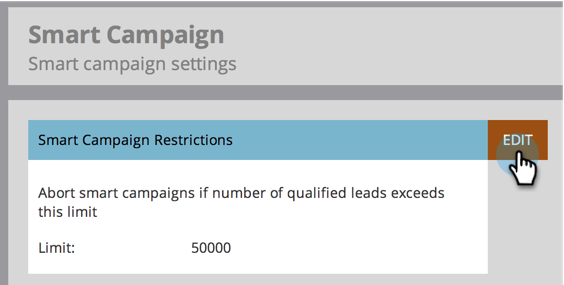

# Enable Person Restrictions for Smart Campaigns {#enable-person-restrictions-for-smart-campaigns}

There is a feature in Marketo to limit the _maximum_ number of people that can qualify for a smart campaign. This avoids accidentally emailing your whole database.

>[!NOTE]
>
>**Admin Permissions Required**

>[!CAUTION]
>
>This applies only to batch campaigns and email programs.

1. Go to the **Admin** area.

   

1. Click **Smart Campaign**.

   

1. Click **Edit**.

   

   >[!CAUTION]
   >
   >If the number of people that qualify to run through a smart campaign exceeds the limit set, then it will not run at all.

1. Enter a limit and click **Save**.

   

   >[!TIP]
   >
   >Disable this feature by making this field blank.

   >[!CAUTION]
   >
   >This limit is applied to all the smart campaigns but can be overridden at campaign level. Learn how to [override person restrictions in a smart campaign](/help/marketo/product-docs/core-marketo-concepts/smart-campaigns/using-smart-campaigns/override-person-restrictions-in-a-smart-campaign.md).

Done! You just turned on the safety switch.

>[!MORELIKETHIS]
>
>[Override Person Restrictions in a Smart Campaign](/help/marketo/product-docs/core-marketo-concepts/smart-campaigns/using-smart-campaigns/override-person-restrictions-in-a-smart-campaign.md)
