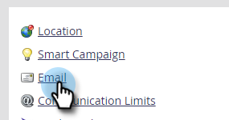
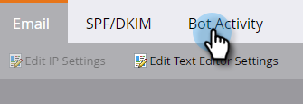
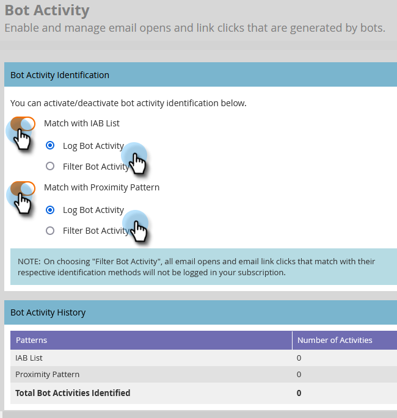
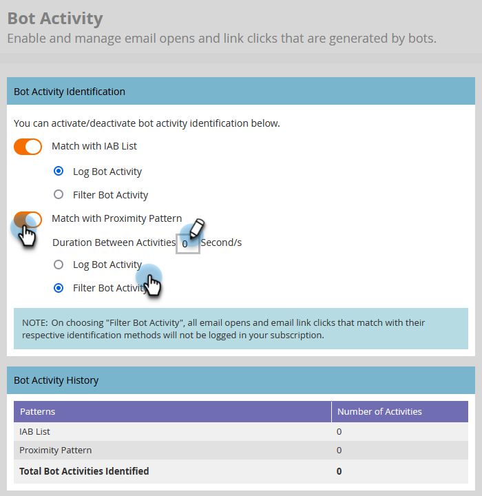

# Filtering Email Bot Activity {#filtering-email-bot-activity}

Sometimes, email bot activity can erroneously inflate your email opens and clicks data. Follow the steps below to fix that.

We use two separate methods to confirm bot activity:

* Match with [Interactive Advertising Bureau bot list](https://www.iab.com/guidelines/iab-abc-international-spiders-bots-list/){target="_blank"}: Activities that match with anything on the IAB UA/IP (User Agent/IP address) list will be marked as bots.
* Match with proximity pattern: When more than two activities happen at the same time (in under a second), they're identified as bots. Attributes considered during comparison are:
    * Lead ID (should be the same)
    * Email asset (should be the same)
    * Link click or email open
    * Time difference (should be less than one second)

Against email link click and email open activity, new attributes will be populated with the values below:

* Activities that are identified as bots will have "Bot Activity" as "True" and "Bot Activity Pattern" as the identified pattern/method
* Activities that are identified as not bots will have "Bot Activity" as "False" and "Bot Activity Pattern" as "N/A"
* Activities that happened before we introduced these attributes will have "Bot Activity" as " " (empty) and "Bot Activity Pattern" as " " (empty)

## Select Filter Type {#select-filter-type}

1. Click **[!UICONTROL Admin]**.

   

1. Click **[!UICONTROL Email]**.

   

1. Click the **[!UICONTROL Bot Activity]** tab.

   

1. There are two sliders to choose from. You can enable just one or both. If you enable **[!UICONTROL Match with IAB List]**, choose whether to [!UICONTROL log bot activity] _or_ [!UICONTROL filter bot activity].

   

1. If you enable **[!UICONTROL Match with Proximity Pattern]**, choose whether to [!UICONTROL log bot activity] _or_ [!UICONTROL filter bot activity]. You can also set the amount of seconds for **Duration Between Activities** (default is 0, max is 3). 

   

>[!NOTE]
>
>With **Duration Between Activities** set to 0 seconds, we will identify email activities that are happening at the exact same second. If multiple email activities happen within the designated amount of seconds, it will be identified as bot activity.

>[!IMPORTANT]
>
>* If you choose [!UICONTROL Filter Bot Activity], you may see a drop in email opens and clicks as false activities are weeded out.

**OPTIONAL STEP**: To disable either feature, simply deselect the resective slider. If you do, the data does not reset.

>[!TIP]
>
>Leverage bot activity data in Smart Lists via "Is Bot Activity" boolean (yes/no) and "Bot Activity Pattern" in the "Clicked Link in Email" and "Open Email" filters, and "Clicks Link in Email" and "Opens Email" triggers.

## IP Blocklist {#ip-blocklist}

We've compiled a list of IP addresses that are responsible for generating millions of fake engagements, as such engagement received from any of the following IPs is automatically filtered out and not added to your Marketo Engage Instance. This may result in a reduction in email opens, clicks, and other related activities. The list below may be updated periodically.

* 40.94.34.52
* 40.94.34.86
* 52.34.76.65
* 54.70.53.60
* 54.71.187.124
* 60.28.2.248
* 64.235.150.252
* 64.235.153.10
* 64.235.153.2
* 64.235.154.105
* 64.235.154.109
* 64.235.154.140
* 64.74.215.1
* 64.74.215.100
* 64.74.215.138
* 64.74.215.139
* 64.74.215.142
* 64.74.215.146
* 64.74.215.150
* 64.74.215.154
* 64.74.215.158
* 64.74.215.162
* 64.74.215.164
* 64.74.215.166
* 64.74.215.170
* 64.74.215.174
* 64.74.215.176
* 64.74.215.178
* 64.74.215.51
* 64.74.215.56
* 64.74.215.58
* 64.74.215.59
* 64.74.215.86
* 64.74.215.98
* 65.154.226.101
* 66.249.91.149
* 70.42.131.106
* 74.125.217.116
* 74.217.90.250
* 104.129.41.4
* 104.47.55.126
* 104.47.58.126
* 104.47.70.126
* 104.47.73.126
* 104.47.73.254
* 104.47.74.126
* 128.220.160.1
* 155.70.39.101
* 162.129.251.14
* 162.129.251.42
* 208.52.157.204
 
>[!NOTE]
>
>We meticulously analyze and scrutinize every IP address before adding it to this list, ensuring only the most critical and harmful IPs are blocked.
