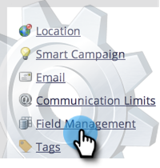
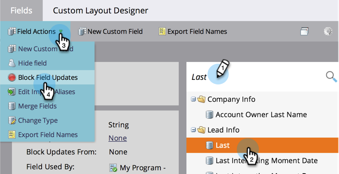
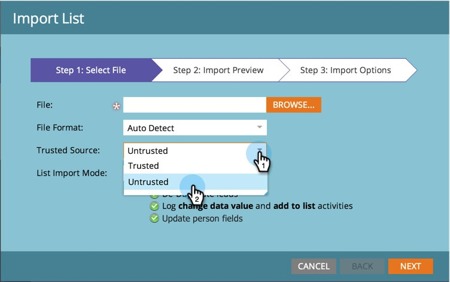

# Block Field Updates During List Import from Untrusted Sources {#block-field-updates-during-list-import-from-untrusted-sources}

You can trust the data in some lists more than others. Sometimes you have questionable data and want to take it if the field is blank, but not if there is an existing value. You can accomplish this by blocking field updates on key fields.

>[!NOTE]
>
>**Admin Permissions Required**

## Blocking Field Updates From Untrusted Sources {#blocking-field-updates-from-untrusted-sources}

1. Go to the **[!UICONTROL Admin]** area.

   

1. Click **[!UICONTROL Field Management]**.

   

1. Find the field you want, select it, then under **[!UICONTROL Field Actions]**, click **[!UICONTROL Block Field Updates]**.

   

1. Check **[!UICONTROL List Import untrusted source]** and click **[!UICONTROL Apply]**.

   

>[!TIP]
>
>You can keep fields safe from all lists, trusted and untrusted, by also checking **[!UICONTROL List Import trusted source]**.

Repeat the above steps for any other fields you want to keep safe from untrusted lists.

## Running an Untrusted List Import {#running-an-untrusted-list-import}

1. When running your list import, be sure to select **[!UICONTROL Untrusted]** if you want all fields you set up in the previous step to be safe.

   

For detailed instructions on importing lists, see [Import a List of People](/help/marketo/getting-started/quick-wins/import-a-list-of-people.md).

Nice work! Now you know how to keep key fields safe from untrusted lists.
