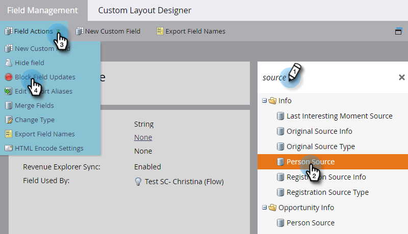

# Block Updates to a Field {#block-updates-to-a-field}

Blocking updates to a field allows you to write to the field once and then retain the original value for the lifetime of the field. This can be useful for a field like [!UICONTROL Person Source].

>[!NOTE]
>
>**Admin Permissions Required**

1. Go to the **[!UICONTROL Admin]** area.

   

1. Click **[!UICONTROL Field Management]**.

   

1. Find the field, select it, then under **[!UICONTROL Field Actions]**, click **[!UICONTROL Block Field Updates]**.

   

   >[!NOTE]
   >
   >You can block updates to [Program Member Custom Fields](/help/marketo/product-docs/core-marketo-concepts/programs/working-with-programs/program-member-custom-fields.md) as well.

1. Select the **[!UICONTROL Input Sources]** you want to block and click **[!UICONTROL Apply]**.

   

   >[!CAUTION]
   >
   >When performing a list import, the status of a field being blocked in the Import Preview will only show if the field is automatically recognized by Marketo based on the name of the field matching _exactly_ (or if aliases are established). If the field is manually chosen from the Marketo Field drop-down, the blocked status will not show in the Import Preview, but update-blocking to that field will still be implemented.
