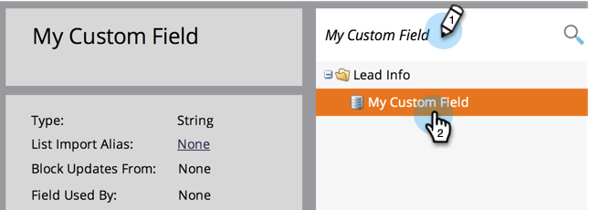
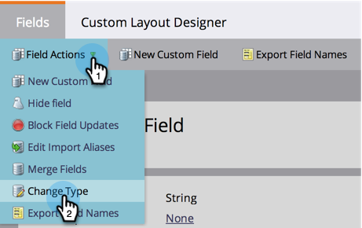
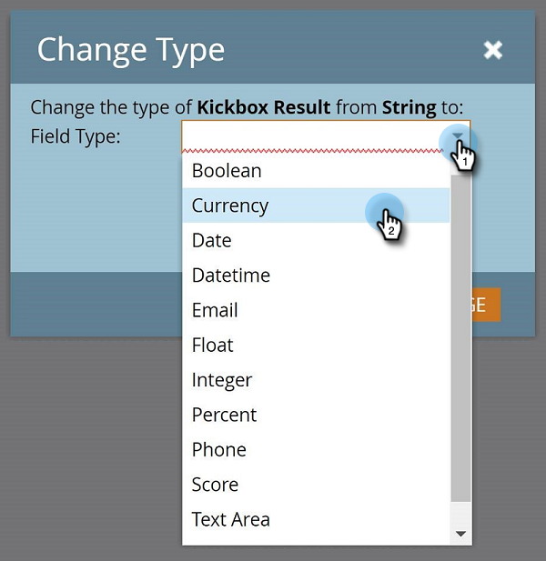
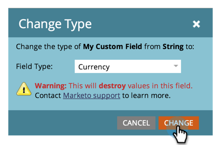

# Change the Type of a Marketo Custom Field {#change-the-type-of-a-marketo-custom-field}

Here's how to change the field type of a Custom Field.

1. Go to the **Admin** area.

   

1. Click **Field Management**.

   

1. Find and select the desired field.

   

1. In the **Field Actions** drop-down, click **Change Type**.

   

1. Select the new type.

   >[!NOTE]
   >
   >Score and formula fields cannot be changed.

   

1. Read the warning, then click **Change** to confirm.

   

   >[!NOTE]
   >
   >The warning message you see will vary depending on what field type you're changing from/to.

   >[!MORELIKETHIS]
   >
   >[Create a Custom Field in Marketo](/help/marketo/product-docs/administration/field-management/create-a-custom-field-in-marketo.md)
