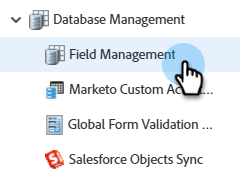
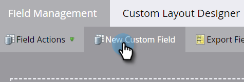
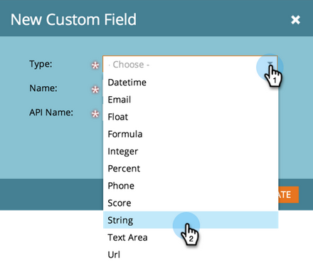
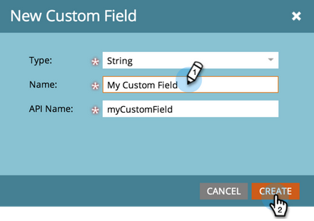

# Create a Custom Field in Marketo {#create-a-custom-field-in-marketo}

If you need a new custom field in Marketo Engage to store/capture data, here's how to create one.

1. Go to the **[!UICONTROL Admin]** area.

   

1. Click **[!UICONTROL Field Management]**.

   

    >[!TIP]
    >
    >If you want the fields to be kept in sync with your CRM, create them in the CRM and they will automatically be created in Marketo.

1. Click **[!UICONTROL New Custom Field]**.

    

1. Choose the field Type. This will change how it's rendered in smart lists and forms in Marketo.

    >[!TIP]
    >
    >Check out the [Custom Field Types Glossary](/help/marketo/product-docs/administration/field-management/custom-field-type-glossary.md).

    

1. Enter the [!UICONTROL Name] as you want it to appear in Marketo. The [!UICONTROL API Name] is automatically generated. You can tweak it, but it cannot be renamed once set. Click **[!UICONTROL Create]** when done.

>[!CAUTION]
>
>Field names cannot start with the following characters: **. & + []**

>[!NOTE]
>
>The API name is used by the SOAP API and other backend processes.

You can now use this custom field in forms, flow steps and Smart Lists!
