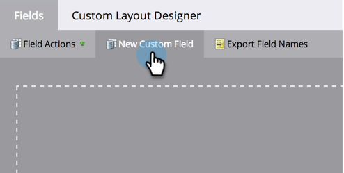
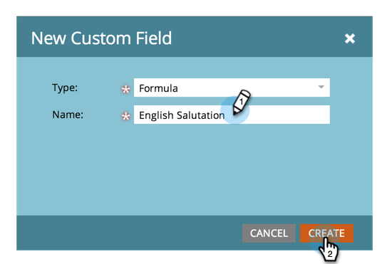
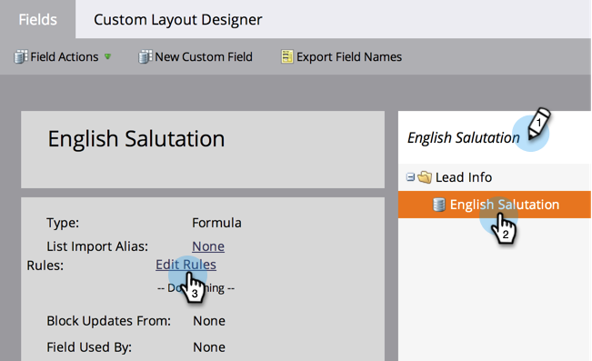
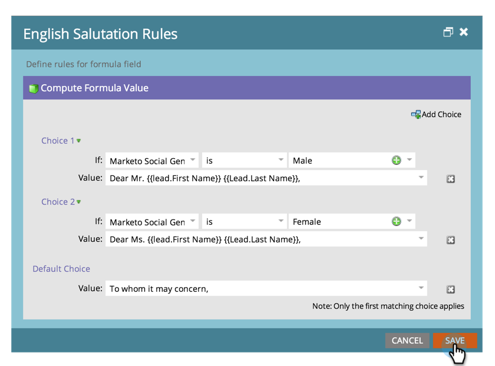
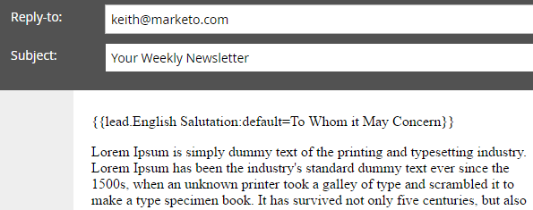

# Create and Use a Concatenated String (Formula) Field {#create-and-use-a-concatenated-string-formula-field}

You can combine values from multiple fields or build a conditional value using a Marketo Formula field.

1. Go to the **[!UICONTROL Admin]** area.

   

1. Click **[!UICONTROL Field Management]**.

   

1. Click **[!UICONTROL New Custom Field]**.

   

1. Select **[!UICONTROL Formula]** for the **[!UICONTROL Type]**.

   

1. Enter a **[!UICONTROL Name]** for your field then click **[!UICONTROL Create]**.

   

1. Find and select your formula field then click **[!UICONTROL Edit Rules]**.

   

1. Add two choices and define them like the screenshot below.

   

   >[!TIP]
   >
   >Learn more about [tokens for flow steps](/help/marketo/product-docs/core-marketo-concepts/smart-campaigns/flow-actions/use-tokens-in-flow-steps.md).

1. Now you can add the formula field as a token in an email.

   

>[!NOTE]
>
>Formula fields can be used in landing pages, emails and smart list columns (they are not exported). Emails with formula fields can _not_ be sent using a batch campaign. Please use an [email script token](/help/marketo/product-docs/email-marketing/general/using-tokens/create-an-email-script-token.md) in this scenario.

Good work! Now you have a smart field that knows what salutation to include based on gender. Have fun with this and get creative.
