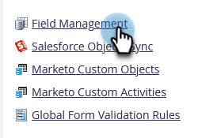
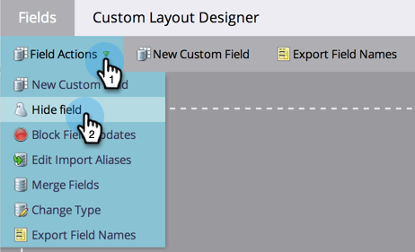

# Delete a Custom Field in Marketo {#delete-a-custom-field-in-marketo}

>[!NOTE]
>
>**Admin Permissions Required**

You may want to get rid of a field you created in the past if you no longer have a use for it. Unfortunately you can't delete fields in Marketo, but you _can_ hide them from the user interface.

1. Go to the **[!UICONTROL Admin]** area.

   

1. Click **[!UICONTROL Field Management]**.

   

1. Click the **[!UICONTROL Field Actions]** drop-down and select **[!UICONTROL Hide Field]**.

   

   For detailed step-by-step instructions, see [hide and unhide a field](/help/marketo/product-docs/administration/field-management/hide-and-unhide-a-field.md).
