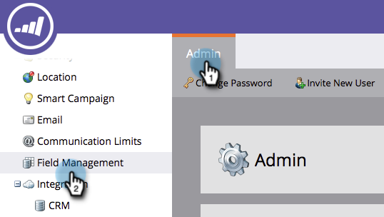
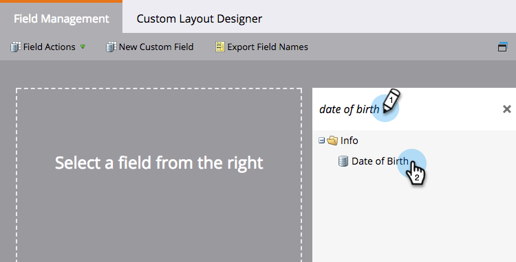

# Edit Field Aliases for List Import {#edit-field-aliases-for-list-import}

When you import a list with unknown headers, you can create field aliases to make it easier. You can also edit those aliases in field management. Check it out.

>[!NOTE]
>
>**Admin Permissions Required**

1. Under **Admin**, click **Field Management**.

   

1. Find and select the field you want to add an alias to.

   

1. In the Field Actions drop-down, click **Edit Import Aliases**.

   

1. Enter an Alias and click **Save**.

   

>[!TIP]
>
>Click **Add Another** and enter more aliases if you need them.

Look at that! Now if you import a spreadsheet with a column named "DOB," Marketo will automatically recognize it as "Date of Birth" and import the data into the correct field.  

