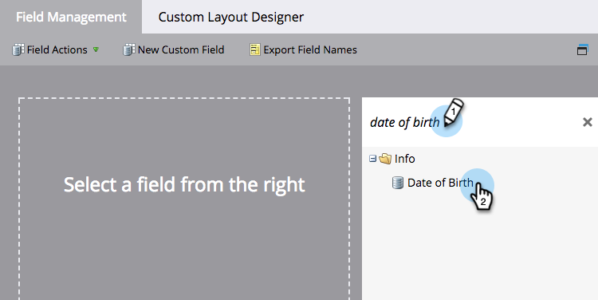
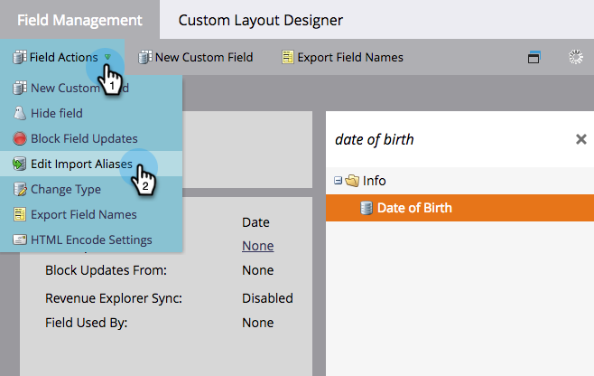
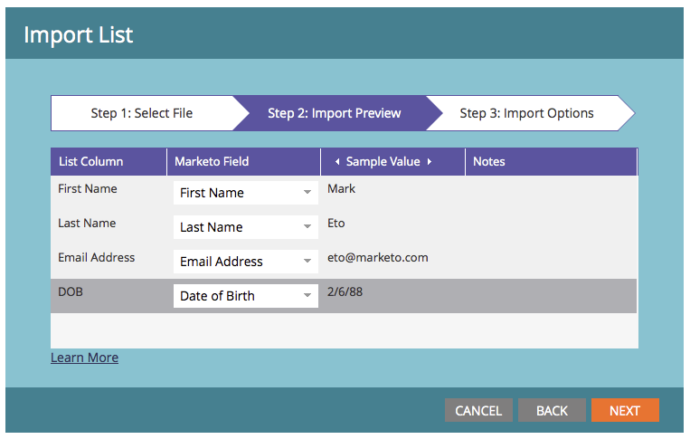

# Edit Field Aliases for List Import {#edit-field-aliases-for-list-import}

When you import a list with unknown headers, you can create field aliases to make it easier. You can also edit those aliases in field management. Check it out.

>[!NOTE]
>
>**Admin Permissions Required**

1. Go to the **[!UICONTROL Admin]** area.

   

1. Click **[!UICONTROL Field Management]**.

   

1. Find and select the field you want to add an alias to.

   

1. In the **[!UICONTROL Field Actions]** drop-down, click **[!UICONTROL Edit Import Aliases]**.

   

1. Enter an Alias and click **[!UICONTROL Save]**.

   

>[!TIP]
>
>Click **[!UICONTROL Add Another]** and enter more aliases if you need them.

Look at that! Now if you import a spreadsheet with a column named "DOB," Marketo will automatically recognize it as "Date of Birth" and import the data into the correct field.  

