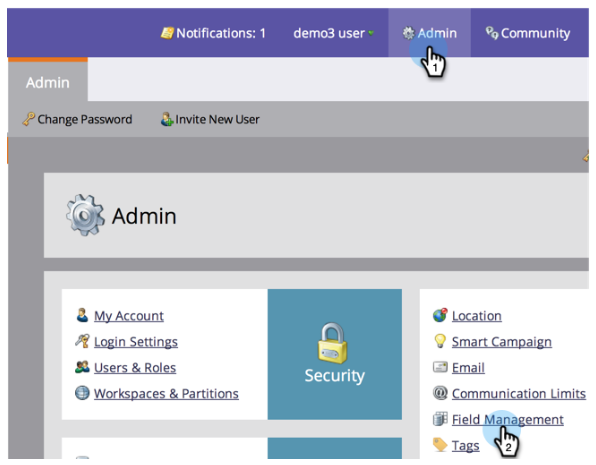

# Export a List of All Marketo API Field Names {#export-a-list-of-all-marketo-api-field-names}

If you're using our SOAP API or Munchkin API you'll need a list of all your fields and their API Names. Here's how to get this list.

>[!NOTE]
>
>**Admin Permissions Required**

1. Go to **Admin** and click **Field Management**.

   

1. Click **Export Field Names** to download the spreadsheet.

   

Nice! You now have a spreadsheet with a list of all your fields and their API Names.

>[!NOTE]
>
>The character limit for MLM API Names is 255.
