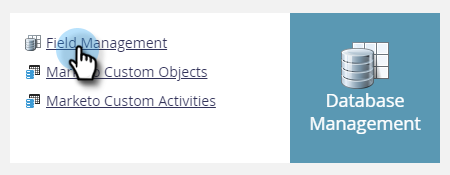
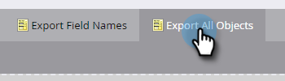
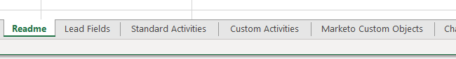

# Export All Object Metadata {#export-all-object-metadata}

This feature allows you to export all objects and their metadata.

>[!NOTE]
>
>**Admin Permissions Required**

## Objects {#objects}

* Lead Fields (Person/Company)
* Marketo Custom Objects
* Standard Activities
* Custom Activities
* Channels
* Tags

## Export Object Metadata {#export-object-metadata}

1. In your My Marketo, click **Admin**.

   

1. Select **Field Management**.

   

1. Click **Export All Objects**.

   

>[!NOTE]
>
>Make sure your browser isn't blocking pop-ups from Marketo.

The data will export as a CSV.

   
