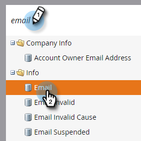
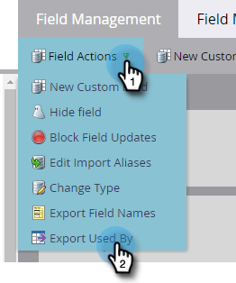

# Export Used By Data for a Field {#export-used-by-data-for-a-field}

As an Admin, you have the ability to export related assets of a field so you can delegate their de-linking to your team.

>[!NOTE]
>
>**Admin Permissions Required**

1. Go to the **[!UICONTROL Admin]** area.

   

1. Click **[!UICONTROL Field Management]**.

   

1. Find the desired field and select it.

   

1. Click the **[!UICONTROL Field Actions]** drop-down and select **[!UICONTROL Export Used By]**.

   

1. An [!DNL Excel] file will export. Open it to view its content.

   

   >[!TIP]
   >
   >Each related asset is a link that can be clicked on and will open in Marketo.
