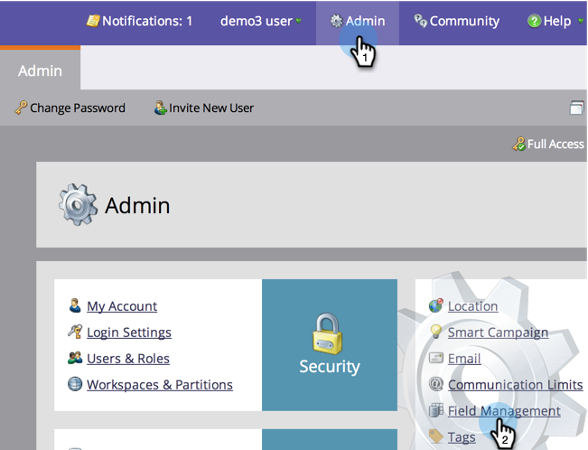
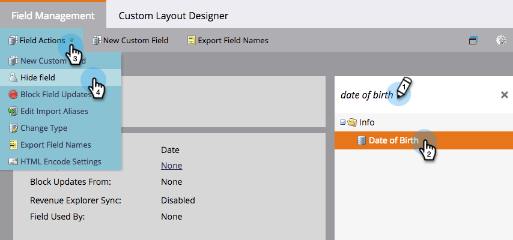
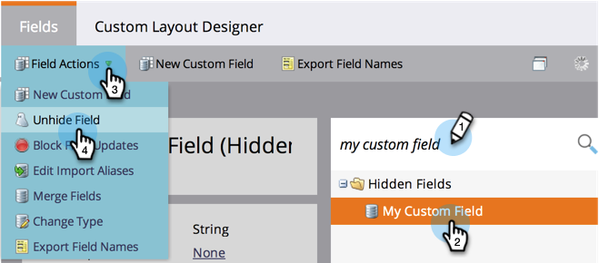

# Hide and Unhide a Field {#hide-and-unhide-a-field}

If you no longer have use for a field in Marketo, you can hide it from the UI so that it no longer displays in the application.

## Hide a Field {#hide-a-field}

>[!NOTE]
>
>**Admin Permissions Required**

1. Go to **[!UICONTROL Admin]** and click **[!UICONTROL Field Management]**.

   

1. Find the field, select it, then under **[!UICONTROL Field Actions]** click **[!UICONTROL Hide Field]**.

   

   >[!NOTE]
   >
   >In order to hide a field it must not be associated with any other assets (including archived ones). Make sure to remove the field from all smart lists, flow step choices, forms, emails, etc., before hiding.

1. Click **[!UICONTROL Hide]** to confirm.

   

   Nice work! Now you know how to hide a field from the Marketo user interface.

   

## Unhide a Field {#unhide-a-field}

1. Go to **[!UICONTROL Admin]** and click **[!UICONTROL Field Management]**.

   

1. Find and select the field. In the **[!UICONTROL Field Actions]** drop-down, click **[!UICONTROL Unhide Field]**.

   

   Great work! Now you know how to unhide fields and make them visible again in the Marketo user interface.

   >[!TIP]
   >
   >Need to have a mass hide/unhide performed? Contact Marketo Professional Services: services@marketo.com.
