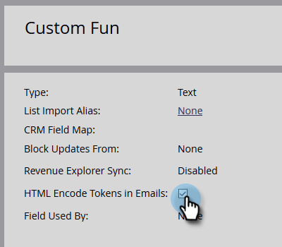

# HTML Encode Tokens in Emails {#html-encode-tokens-in-emails}

Enable/disable person and company tokens used in emails.

>[!NOTE]
>
>**Admin Permissions Required**

>[!NOTE]
>
>Encoding converts characters into their HTML code versions to prevent confusion when being transmitted (i.e. "&" is changed to `&amp;`). For more details, please consult your web developer.

1. Go to the **[!UICONTROL Admin]** area.

   

1. Click **[!UICONTROL Field Management]**.

   

1. Find and select your desired field.

   

1. Check the **[!UICONTROL HTML Encode Tokens in Emails]** box to enable, uncheck to disable.

   

   And that's it! You can do that for as many individual fields as you want.
