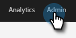
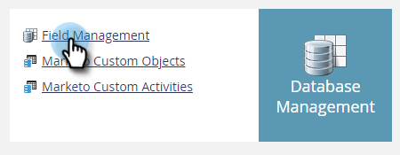
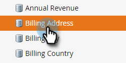
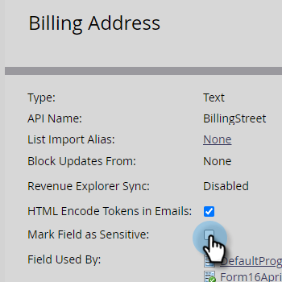

# Mark a Field as Sensitive {#mark-a-field-as-sensitive}

As a Marketo Admin, you can mark a specific field as "sensitive" so its values never get pre-filled in forms, thereby protecting users' sensitive data.

>[!NOTE]
>
>This feature will be enabled for all Marketo instances on the evening of Tuesday, May 11.

1. Click **[!UICONTROL Admin]**.

   

1. Click **[!UICONTROL Field Management]**.

   

1. Find and select your desired field.

   

1. Select the **[!UICONTROL Mark Field as Sensitive]** checkbox.

   

And that's it! Going forward, any Marketo forms enabled with pre-fill will not display data for the selected field.
