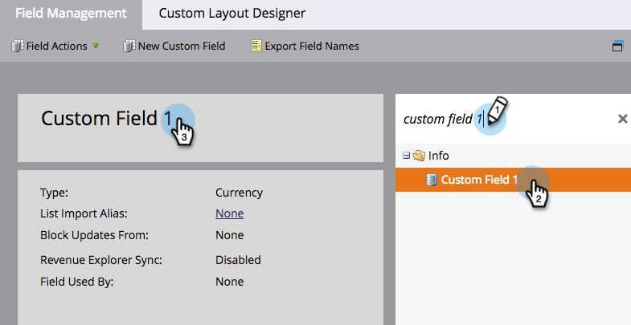
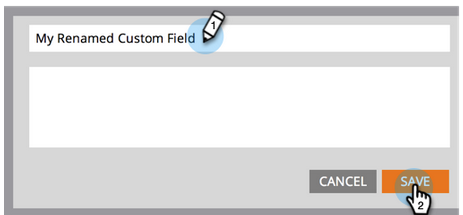

# Rename a Field {#rename-a-field}

>[!NOTE]
>
>You can rename a custom field in Marketo, but there's one catch: you must remove all of its use in the system before you do so. This includes forms, smart lists, and smart campaigns.

>[!NOTE]
>
>**Admin Permissions Required**

1. Go to **[!UICONTROL the **Admin]**** area.

   

1. Click **[!UICONTROL Field Management]**.

   

1. Find and select the field you want to rename, then click the field name in the canvas.

   

   >[!TIP]
   >
   >Click the **[!UICONTROL Used By]** link to find assets that reference this field.

1. Rename the field and click **[!UICONTROL Save]**.

   

Nice job! You now know how to rename fields in Marketo.

>[!CAUTION]
>
>If you rename the API name in [!DNL Salesforce], Marketo will create a brand new field and leave the old one behind!
