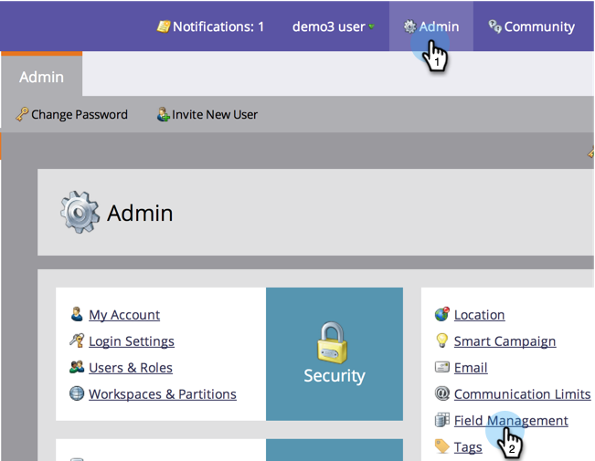

# View Field Mappings Between Marketo and Salesforce {#view-field-mappings-between-marketo-and-salesforce}

You may want to know which Salesforce fields a specific Marketo field is tied to. Here's how to accomplish this.

>[!NOTE]
>
>**Admin Permissions Required**

1. Go to **Admin** and click **Field Management**.

   

1. Find the field you're interested in seeing and click the **+** to expand the mapping.

   

>[!NOTE]
>
>This is displaying the Salesforce API name, not label name.

Nice work! You now know how to find out which Salesforce fields your Marketo fields are tied to. 