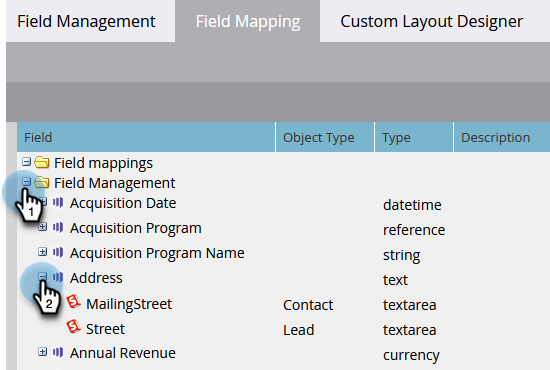

# View Field Mappings Between Marketo and [!DNL Salesforce] {#view-field-mappings-between-marketo-and-salesforce}

You may want to know which [!DNL Salesforce] fields a specific Marketo field is tied to. Here's how to check.

>[!NOTE]
>
>**Admin Permissions Required**

1. Go to the **[!UICONTROL Admin]** area.

   

1. Click **[!UICONTROL Field Management]**.

   

1. Find the field you're interested in seeing and click the **+** to expand the mapping.

   

>[!NOTE]
>
>This is displaying the [!DNL Salesforce] API name, not label name.

>[!IMPORTANT]
>
>The fields listed reflect data from the initial mapping only. They do not get updated after the Marketo/[!DNL Salesforce] sync.
