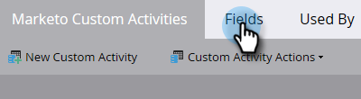
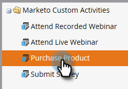
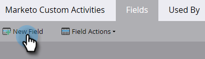
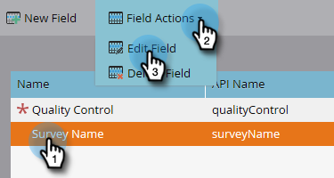
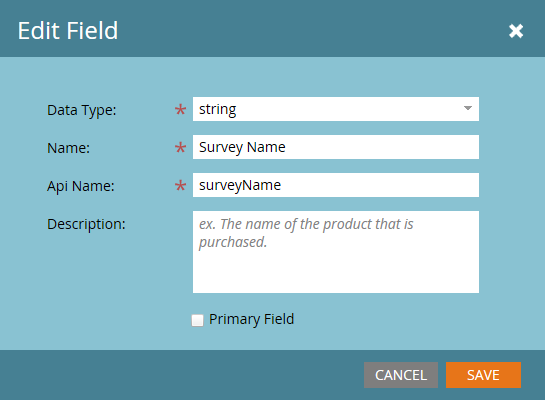
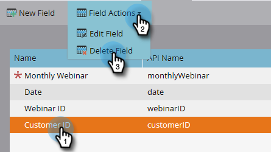

# Add/Edit/Delete Marketo Custom Activity Fields {#add-edit-delete-marketo-custom-activity-fields}

You may need to add, change, or even get rid of a custom activity field. Here's how.

## Add a Custom Activity Field {#add-a-custom-activity-field}

1. Go to the **Admin** area.

   

1. Click **Marketo Custom Activities**.

   

1. Click **Fields**.

   

1. Select the custom activity you want to add a field to.

   

1. Click **New Field**.

   

1. Choose the field's data type.

   

   >[!TIP]
   >
   >Not sure what to select? We've got you covered! All of the available data types are defined in [this article](/help/marketo/product-docs/administration/field-management/custom-field-type-glossary.md).

1. Name the field. The Api Name auto-populates. When you're done, click **Save**.

   

   That's it! Your new field has been added.

## Edit a Custom Activity Field {#edit-a-custom-activity-field}

1. Go to the **Admin** area.

   

1. Click **Marketo Custom Activities**.

   

1. Click **Fields**.

   

1. Select the custom activity that contains the field you want to edit.

   

1. Select the field you want to edit, click the **Field Actions** drop-down, and select **Edit Field**.

   

   The Edit Field pop-up appears. In this example let's change the name of the field.

   

1. Enter the new Name and Api Name, then click **Save**.

   

   >[!NOTE]
   >
   >The Api Name will not auto-populate when editing a field. While it's not required that the Field Name and Api Name match, we recommend they do.

   >[!CAUTION]
   >
   >You can only edit the Api Name or change the field to Primary if the custom activity has never been published.

   >[!NOTE]
   >
   >If you want to change which field is Primary, you must first deselect the existing one.

Your field is now edited!

## Delete a Custom Activity Field {#delete-a-custom-activity-field}

1. Go to the **Admin** area.

   

1. Click **Marketo Custom Activities**.

   

1. Click **Fields**.

   

1. Select the custom activity that contains the field you want to delete.

   

1. Select the field you want to delete, click the **Field Actions** drop-down, and select **Delete Field**.

   
