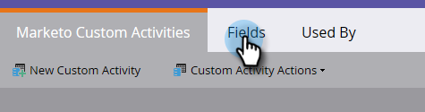
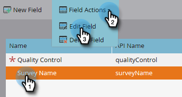
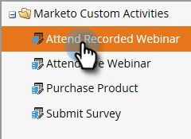

# Add/Edit/Delete Marketo Custom Activity Fields {#add-edit-delete-marketo-custom-activity-fields}

You may need to add, change, or even get rid of a custom activity field. Here's how.

## Add a Custom Activity Field {#add-a-custom-activity-field}

1. In Marketo Custom Activities, click **Fields**.

   

1. Select the custom activity you want to add a field to.

   

1. Click **New Field**.

   

1. Choose the field's data type.

   

   >[!TIP]
   >
   >Not sure what to select? We've got you covered! All of the available data types are defined in [this article](../../../product-docs/administration/field-management/custom-field-type-glossary.md).

1. Name the field. The Api Name auto-populates. When you're done, click **Save**.

   

   That's it! Your new field has been added.

## Edit a Custom Activity Field {#edit-a-custom-activity-field}

1. In Marketo Custom Activities, click **Fields**.

   

1. Select the custom activity that contains the field you want to edit.

   

1. Select the field you want to edit, click the **Field Actions** drop-down, and select **Edit Field**.

   

   The Edit Field pop-up appears. In this example let's change the name of the field.

   

1. Enter the new Name and Api Name, then click **Save**.

   

   >[!NOTE]
   >
   >The Api Name will not auto-populate when editing a field. While it's not required that the Field Name and Api Name match, we recommend they do.

   >[!CAUTION]
   >
   >You can only edit the Api Name or change the field to Primary if the custom activity has never been published. If the activity has already been published, you can only edit the field's name and optional description.

   >[!NOTE]
   >
   >If you want to change which field is Primary, you must first deselect the existing one.

Your field is now edited! 

## Delete a Custom Activity Field {#delete-a-custom-activity-field}

1. In Marketo Custom Activities, click **Fields**.

   

1. Select the custom activity that contains the field you want to delete.

   

1. Select the field you want to delete, click the **Field Actions** drop-down, and select **Delete Field**.

   

   It's just that easy!

