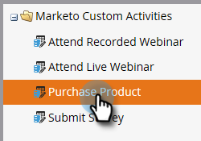
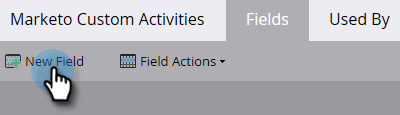
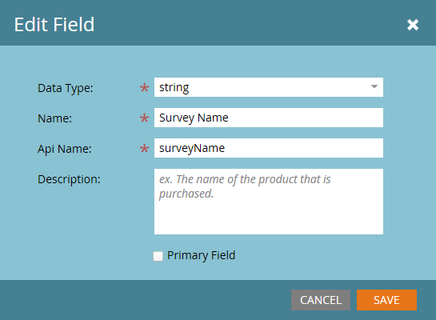

# Add, Edit, or Delete Marketo Custom Activity Fields {#add-edit-delete-marketo-custom-activity-fields}

Learn how to add, change, or remove a custom activity field.

## Add a Custom Activity Field {#add-a-custom-activity-field}

1. Go to the **[!UICONTROL Admin]** area.

   

1. Click **[!UICONTROL Marketo Custom Activities]**.

   

1. Click **[!UICONTROL Fields]**.

   

1. Select the custom activity you want to add a field to.

   

1. Click **[!UICONTROL New Field]**.

   

1. Choose the field's [!UICONTROL data type].

   

   >[!TIP]
   >
   >For definitions of all available data types, see [this article](/help/marketo/product-docs/administration/field-management/custom-field-type-glossary.md).

1. Name the field. The [!UICONTROL API Name] auto-populates. When you are done, click **[!UICONTROL Save]**.

   

   Your new field has been added.

## Edit a Custom Activity Field {#edit-a-custom-activity-field}

1. Go to the **[!UICONTROL Admin]** area.

   

1. Click **[!UICONTROL Marketo Custom Activities]**.

   

1. Click **[!UICONTROL Fields]**.

   

1. Select the custom activity that contains the field you want to edit.

   

1. Select the field you want to edit, click the **[!UICONTROL Field Actions]** drop-down, and select **[!UICONTROL Edit Field]**.

   

   The **[!UICONTROL Edit Field]** pop-up appears. In this example, the field name is being changed.

   

1. Enter the new Name and [!UICONTROL API Name], then click **[!UICONTROL Save]**.

   

   >[!NOTE]
   >
   >The [!UICONTROL API Name] will not auto-populate when editing a field. While it is not required that the Field [!UICONTROL Name] and [!UICONTROL API Name] match, Marketo recommends they do.

   >[!CAUTION]
   >
   >You can only edit the [!UICONTROL API Name] or change the field to Primary if the custom activity has never been published.

   >[!NOTE]
   >
   >If you want to change which field is Primary, you must first deselect the existing one.

The field has been updated.

## Delete a Custom Activity Field {#delete-a-custom-activity-field}

1. Go to the **[!UICONTROL Admin]** area.

   

1. Click **[!UICONTROL Marketo Custom Activities]**.

   

1. Click **[!UICONTROL Fields]**.

   

1. Select the custom activity that contains the field you want to delete.

   

1. Select the field you want to delete, click the **[!UICONTROL Field Actions]** drop-down, and select **[!UICONTROL Delete Field]**.

   
