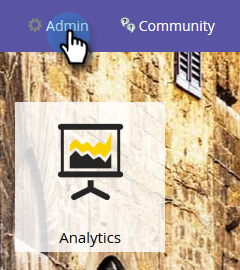
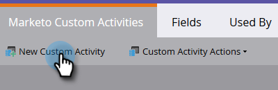
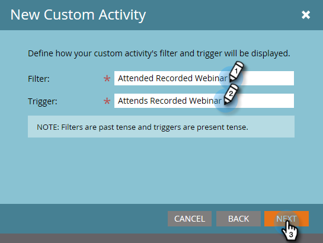

# Create a Custom Activity {#create-a-custom-activity}

Follow these steps to create a new custom activity.

>[!NOTE]
>
>Most subscriptions have an allocated limit of 10 Custom Activity types.

1. Click **Admin**.

   

1. In **Database Management** click **Custom Activities**.

   

1. Click **New Custom Activity**.

   

1. Enter a name and optional description, then click **Next**. The API Name auto-fills, but can be customized.

   

   >[!CAUTION]
   >
   >If you decide to change the API name, make sure the name does not conflict with fields in other custom activities.

1. Define your **Filter** and **Trigger** and click **Next**.

   

1. Give your primary field a name that summarizes what the custom activity is for.

   

   And that's it!

>[!MORELIKETHIS]
>
>* [Understanding Custom Activities](understanding-custom-activities.md)
>

