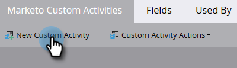
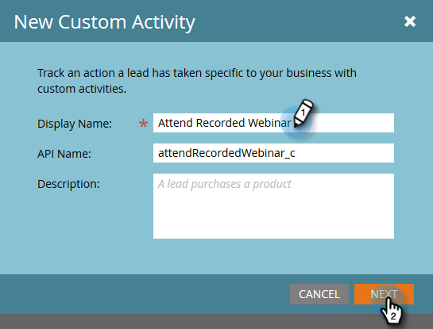
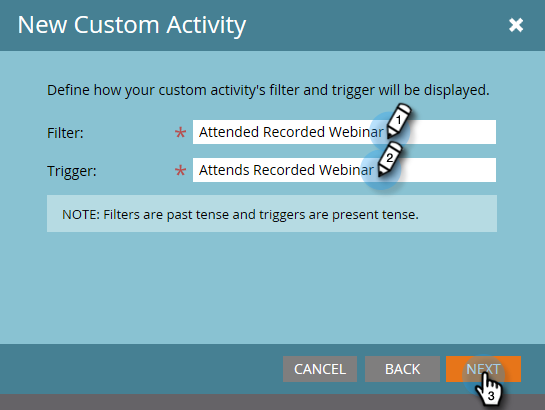
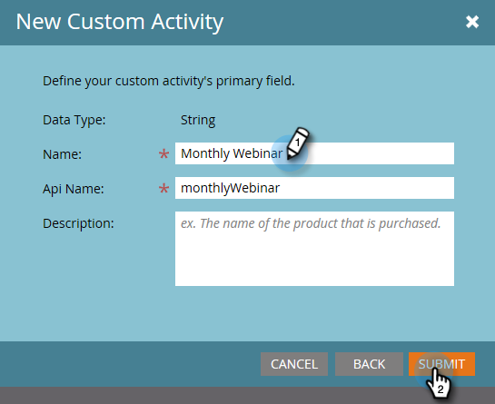

# Create a Custom Activity {#create-a-custom-activity}

Follow these steps to create a new custom activity.

>[!NOTE]
>
>Most subscriptions have an allocated limit of 10 Custom Activity types.

1. Go to the **[!UICONTROL Admin]** area.

   

1. Click **[!UICONTROL Marketo Custom Activities]**.

   

1. Click **[!UICONTROL New Custom Activity]**.

   

1. Enter a name and optional [!UICONTROL Description], then click **[!UICONTROL Next]**. The API Name auto-fills, but can be customized.

   

   >[!CAUTION]
   >
   >If you decide to change the API name, make sure the name does not conflict with fields in other custom activities.

1. Define your [!UICONTROL Filter] and [!UICONTROL Trigger] and click **[!UICONTROL Next]**.

   

1. Give your primary field a name that summarizes what the custom activity is for.

   

>[!MORELIKETHIS]
>
>[Understanding Custom Activities](/help/marketo/product-docs/administration/marketo-custom-activities/understanding-custom-activities.md)
