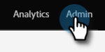
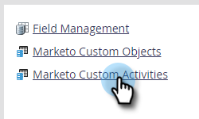
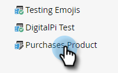
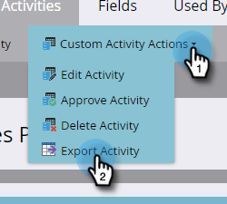

# Custom Activity Metadata Export {#custom-activity-metadata-export}

Follow the steps below to export your Custom Activity Metadata Schema.

1. In My Marketo, click **[!UICONTROL Admin]**.

   

1. Click **[!UICONTROL Marketo Custom Activities]**.

   

1. Select the Marketo Custom Activity you want to export.

   

1. Click the **[!UICONTROL Custom Activity Actions]** drop-down and select **[!UICONTROL Export Activity]**.

   

>[!NOTE]
>
>The Custom Activity must be in the Approved state to be exported.

You now have a spreadsheet with the Schema of the Custom Activty, across three tabs.
