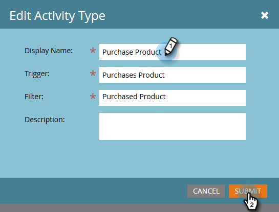

# Edit a Custom Activity {#edit-a-custom-activity}

Need to make changes to a custom activity you've already created? Here's how.

1. Click **[!UICONTROL Admin]**.

   

1. In **[!UICONTROL Database Management]** click **[!UICONTROL Custom Activities]**.

   

1. Select the custom activity you want to edit.

   

1. Click **[!UICONTROL Custom Activity Actions]** and select **[!UICONTROL Edit Activity]**.

   

   **[!UICONTROL Edit Activity Type]** appears. In this example we're fixing a typo.

   

1. Enter your new info and click **[!UICONTROL Submit]**.

   

   Your custom activity is now edited!

   >[!NOTE]
   >
   >If your activity was a draft at the time of editing, it remains a draft. If it was published, the status changes to Published with Draft.
