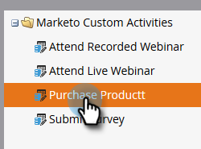

# Edit a Custom Activity {#edit-a-custom-activity}

To make changes to a custom activity that has already been created, follow the steps below.

1. Go to the **[!UICONTROL Admin]** area.

   

1. Click **[!UICONTROL Marketo Custom Activities]**.

   

1. Select the custom activity you want to edit.

   

1. Click **[!UICONTROL Custom Activity Actions]** and select **[!UICONTROL Edit Activity]**.

   

   Edit Activity Type appears. In this example, a typo is being corrected.

   

1. Enter the updated information and click **[!UICONTROL Submit]**.

   

   The custom activity has been updated.

   >[!NOTE]
   >
   >If your activity was a draft at the time of editing, it remains a draft. If it was published, the status changes to Published with Draft.
