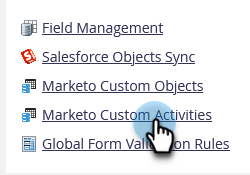
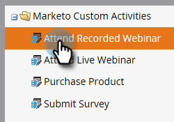
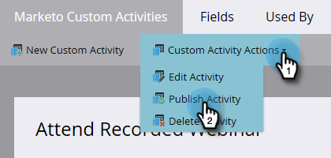
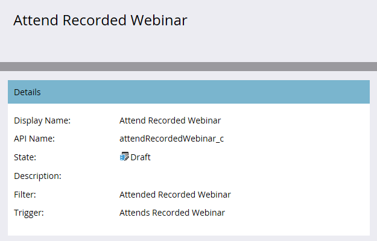

# Publish a Custom Activity {#publish-a-custom-activity}

You have your custom activity exactly as you want it. Now, it's time to publish it!

1. Go to the **[!UICONTROL Admin]** area.

   

1. Click **[!UICONTROL Marketo Custom Activities]**.

   

1. Select the custom activity you want to publish.

   

1. Click the **[!UICONTROL Custom Activity Actions]** drop-down and select **[!UICONTROL Publish Activity]**.

   

   You'll see your custom activity's [!UICONTROL state] go from [!UICONTROL Draft]...

   

   ...to [!UICONTROL Published].

   

   Nicely done!
