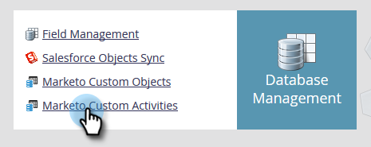
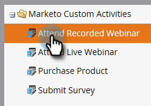
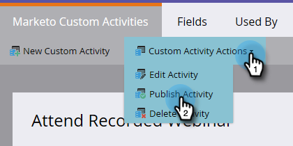

# Publish a Custom Activity {#publish-a-custom-activity}

You have your custom activity exactly as you want it. Now, it's time to publish it!

1. Click **Admin**.

   

1. In **Database Management** click **Marketo Custom Activities**.

   

1. Select the custom activity you want to publish.

   

1. Click the **Custom Activity Actions** drop-down and select **Publish Activity**.

   

   You'll see your custom activity's state go from Draft...

   

   ...to Published.

   

   Nicely done!
